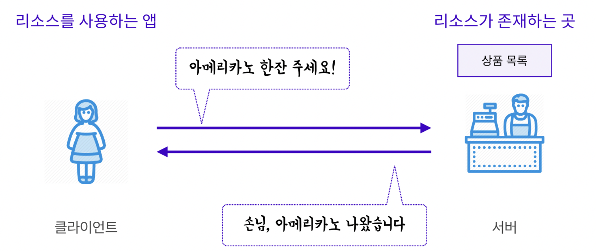
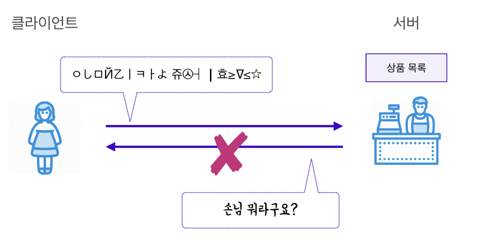
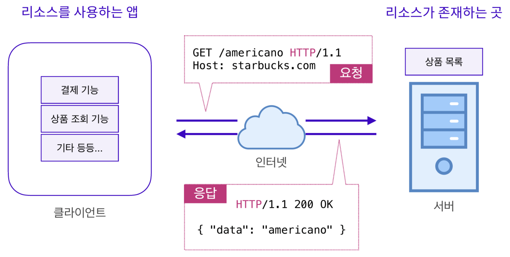
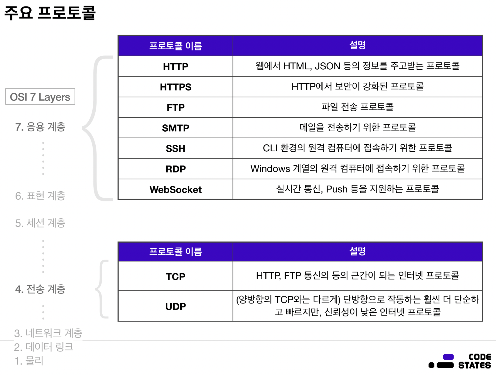

# 브라우저의 작동 원리(How The Browser Works)

## Client-Server Architecture (2 Tier Architecture)
클라이언트 서버 아키텍처, 다른 말로는 2티어 아키텍처라고 한다.

스마트폰에서 쇼핑몰 앱을 사용해 본 적이 있는가? 또한, 인터넷 연결 없이 쇼핑몰 앱을 실행시켜 본 적이 있는가?  
인터넷 연결이 없다면 쇼핑몰 앱은 정상적으로 동작하지 않는다. 왜냐하면 상품 정보들을 `서버(Server)`로부터 받아오기 때문이다.

그렇다면 가능성은 희박하지만 모든 상품 정보들이 앱 안에 담긴 경우를 생각해보자. 이 때 `앱과 연결된 서버가 존재하지 않는다면?`  
이러한 경우 신상품을 업데이트 할 때마다 현재 버전의 앱에는 신상품에 대한 정보가 없어서 앱을 통째로 업데이트를 시켜야 할 것이다.
즉, 앱 사용자들에게 실시간으로 상품 정보를 전달하기가 어려울 것이다. 또한 서버가 없다면 "결제"라는 행동을 할 수가 없다. 결제 또한 은행 서버와 연결이 되어 있어야 하기 때문이다.

이렇게 상품 정보들과 같은 리소스가 존재하는 곳과 리소스를 사용하는 앱을 분리시킨 것을 클라이언트-서버 아키텍처, 2티어 아키텍처라 한다.
즉, 리소스를 사용하는 앱을 `클라이언트`, 리소스를 제공(serve)하는 곳을 `서버(Server)`라고 부른다.

**출처 : CodeStates**

위의 그림을 보자. `상품 정보는 서버에서 다루고, 클라이언트는 단지 상품 정보를 조회할 뿐이다.`  
이처럼 클라이언트와 서버는 요청과 응답을 주고받는 관계다. 반드시 요청이 선행되고 그 후에 응답이 온다. 요청을 하지 않았는데 응답이 오는 경우는 없다.

 

### 3 Tier Architecture
  
**출처 : https://www.ibm.com/cloud/blog/four-architecture-choices-for-application-development**

일반적으로 서버는 리소스를 전달해주는 역할이다. 그래서 리소스를 전달해주는 공간을 별도로 마련해 두는데,
이 공간을 `데이터베이스(Database)`라고 부른다. 이처럼 2티어 아키텍처에 데이터베이스가 추가된 형태를 3티어 아키텍처라 한다.

## 클라이언트-서버 통신과 API

  
**출처 : CodeStates**

카페를 예시로 들어보자. 클라이언트와 서버 간의 통신은 `요청(Request)과 응답(Response)`으로 구성된다.

  
**출처 : CodeStates**

클라이언트와 서버 간의 통신을 알아보려면, 그 전에 `프로토콜(Protocol)`이라는 개념을 이해해야 한다.
프로토콜은 통신 규약, 즉 약속이다. 손님이 주문을 받는 사람에게 서로의 공통어가 아닌 언어로 주문할 수 없는 것처럼, 주문을 하기 위해서는 꼭 지켜야 할 약속이 있다.

**출처 : CodeStates**

웹 애플리케이션 아키텍처에서는 클라이언트와 서버가 서로 `HTTP`라는 프로토콜을 이용해 대화한다. HTTP를 이용해 주고받는 메세지를 `HTTP 메세지`라고 부른다.
앱을 이용하거나, 키오스크를 이용하는 등 카페에서 주문할 수 있는 방법 등 이러한 방법들 하나하나를 프로토콜이라 한다.
프로토콜은 각자의 프로토콜마다 지켜야 하는 약속이 있다.

**출처 : CodeStates**

이러한 네트워크 기초 지식은 간혹 면접에서 요구하는 경우가 있으므로 알아두는 것이 좋다.

### API

 

___
### `Reference`
[3 Tier Architecture][link]

[link]: https://www.ibm.com/kr-ko/cloud/learn/three-tier-architecture
