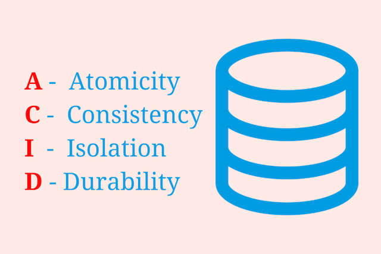

# ACID
___
## 트랜잭션(Transaction)
트랜잭션(`Transaction`)이란 여러 개의 작업을 하나로 묶은 유닛이다. 즉 `데이터베이스의 상태를 변환시키는 기능을 수행하기 위한 하나 이상의 쿼리를 모아 놓은 하나의 작업 단위`를 말한다.
```
예시) 사용자 A가 사용자 B에게 10,000원을 송금한다.

이때 Database 작업은
1. 사용자 A의 계좌에서 10,000원을 차감한다. : UPDATE 문을 사용해 사용자 A의 잔고를 변경
2. 사용자 B의 계좌에 10,000원을 추가한다. : UPDATE 문을 사용해 사용자 B의 잔고를 변경

현재 작업 단위(트랜잭션) : 출금 UPDATE문 + 입금 UPDATE문
- 위 두 쿼리문이 모두 성공적으로 완료되어야만 하나의 작업(트랜잭션)이 완료되는 것이다. 'Commit'
- 작업 단위에 속하는 쿼리 중 하나라도 실패하면 모든 쿼리문을 취소하고 실행하기 이전의 상태로 돌린다. 'Rollback'

하나의 트랜잭션을 잘 설계하는 것이 데이터를 다룰 때 많은 이점을 가져다 준다. 
```

- 각 트랜잭션은 하나의 특정 작업으로 시작으로 `모든 작업을 완료해야` 정상적으로 종료된다.
- 만약 하나의 트랜잭션에 속해있는 여러 작업 중에서 단 하나의 작업이라도 실패한다면, 이 트랜잭션에 속한 모든 작업을 실패한 것으로 판단한다.
- 즉, 작업 하나라도 실패한다면 트랜잭션은 실패, 모든 작업이 성공한다면 트랜잭션 또한 성공이라는 말이다.
- 성공 또는 실패라는 두 개의 결과만 존재하는 트랜잭션은 `미완료된 작업 없이` 모든 작업을 성공해야 한다.
- 데이터베이스 트랜잭션은 `ACID`라는 특성을 가지고 있다.

<br>

## ACID



`ACID`는 데이터베이스 내에서 일어나는 `하나의 트랜잭션의 안정성을 보장`하기 위해서 필요한 성질이다.
- ACID는 관계형 데이터베이스를 이용하는 주식거래나 금융업에서 중점적으로 사용된다.
- 관계형 데이터베이스를 사용하면 데이터베이스와 상호 작용하는 방식을 정확하게 규정할 수 있기 때문에 데이터베이스에서 데이터를 처리할 때 발생할 수 있는 예외적인 상황을 줄이고, 데이터베이스의 무결성을 보호할 수 있다.

### Atomicity(원자성)
`하나의 트랜잭션의 작업들이 모두 성공하거나, 반대로 모두 실패하는 성질`을 말한다. 위에서 예시로 든 트랜잭션을 보자.  
계좌이체를 하려는데 A 계좌에서는 출금이 성공하고, B 계좌에서는 입금되지 않았다고 가정한다. 만약 은행에서 이런 일이 발생한다면 은행은 더이상 제 기능을 할 수 없다.
A 계좌에서 출금하는 일에 성공했지만, B 계좌에 입금하는 작업에 실패한다면 계좌 A에서 출금하는 작업을 포함해 모든 작업이 실패로 돌아가야 한다는 것이 Atomicity(원자성)이다.

원자성을 지켰다면, 출금과 입금이 모두 성공적으로 이루어져야 한다. 그렇지 않으면, 즉 둘 중 하나의 작업이라도 실패한다면, 하나로 묶여있는 모든 작업이 실패하게 만들어 기존 데이터를 보호한다.`Rollback`

SQL에서도 마찬가지로 특정 쿼리를 실행했을 때 부분적으로 실패하는 부분이 있다면, 전부 실패하도록 구현되어 있다. 때에 따라 충돌 요인에 대해 선택지를 제공하기도 한다.

### Consistency(일관성)
`하나의 트랜잭션이 실행을 성공적으로 완료하면 언제나 일관성 있는 데이터베이스 상태로 유지하는 것`을 의미한다. 다시 말해서 트랜잭션이 일어난 이후의 데이터베이스는 데이터베이스의 제약이나 규칙을 만족해야 한다는 뜻이다.

예를 들어, '모든 고객은 반드시 번호를 가져야 한다' 는 데이터베이스 제약이 있다고 가정하자.  
다음의 트랜잭션은 Consistency(일관성)을 위배한다.
1. 번호가 없는 새로운 고객을 추가하는 쿼리
2. 기존 고객의 번호를 삭제하는 쿼리

데이터베이스의 유효한 상태는 다를 수 있다. 하지만 데이터의 상태에 대한 일관성은 유지해야 한다.
이러한 예시는 '번호를 가져야 한다' 라는 제약을 위반한다.
따라서 트랜잭션이 일어난 이후의 데이터베이스는 일관되지 않은 상태를 가지게 된다.

### Isolation(고립성)
`하나의 트랜잭션은 다른 트랜잭션으로부터 독립되어야 함`을 말한다. 즉, 동시에 여러 개의 트랜잭션들이 수행될 때, 각 트랜잭션은 고립되어 있어 연속으로 실행한 것과 동일한 결과를 나타낸다는 뜻이다.

예를 들어, 계좌 A에 10,000원이 있다고 가정하자.  
A 계좌로부터 계좌 B에 7,000원을, 계좌 C로 7,000원을 동시에 송금하는 경우와 계좌 B에 먼저 송금한 뒤, 계좌 C에 송금하는 경우의 결과는 동일해야 한다.
즉 동시에 트랜잭션을 실행한다고 해서 계좌 B와 계좌 C에 각각 7,000원씩 송금하여 마이너스 통장이 되지 않는다는 것이다.

또한, Isolation(고립성)을 지키는 각 트랜잭션은 철저히 독립적이기 떄문에 다른 트랜잭션의 작업 내용을 알 수 없다.

### Durability(지속성)
`하나의 트랜잭션이 성공적으로 수행되었을 떄, 해당 트랜잭션에 대한 로그가 남아있어야 하는 성질`을 말한다. 만약 런타임 오류나 시스템 오류가 발생하더라도, 해당 기록은 영구적이어야 한다는 뜻이다.

예를 들어 계좌이체를 성공적으로 실행한 뒤, 해당 은행의 데이터베이스에 오류가 발생해 종료되더라도 계좌이체 내역은 기록으로 남아야 한다.  
마찬가지로 계좌이체 내역을 로그로 기록하기 이전에 시스템 오류 등에 의해 종료가 된다면, 해당 이체 내역은 실패로 돌아가고, 각 계좌들은 계좌이체 이전의 상태로 돌아가게 된다. 

<br>

___
### `Reference`

[ACID][link]

[link]: https://hanamon.kr/%EB%8D%B0%EC%9D%B4%ED%84%B0%EB%B2%A0%EC%9D%B4%EC%8A%A4-%ED%8A%B8%EB%9E%9C%EC%9E%AD%EC%85%98%EC%9D%98-acid-%EC%84%B1%EC%A7%88/

