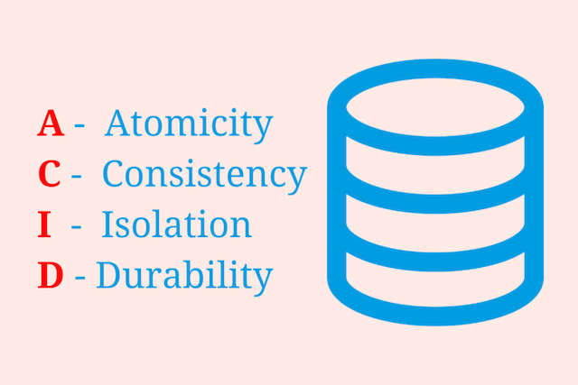

# MySQL
___
### `Reference`

[TCP School][link] - MySQL & Database 정의

[link]: http://tcpschool.com/mysql/intro
[생활코딩 Database][link] - 데이터베이스란 무엇인지 + MySQL CLI 사용법

[link]: https://opentutorials.org/course/3161

[w3schools][link] - SQL 문법

[link]: https://www.w3schools.com/sql/default.asp

___

## ACID

### 트랜잭션(Transaction)
트랜잭션(`Transaction`)이란 여러 개의 작업을 하나로 묶은 유닛이다. 즉 데이터베이스의 상태를 변환시키는 기능을 수행하기 위한 하나 이상의 쿼리를 모아 놓은 하나의 작업 단위를 말한다.
- 각 트랜잭션은 하나의 특정 작업으로 시작으로 `모든 작업을 완료해야` 정상적으로 종료된다.
- 만약 하나의 트랜잭션에 속해있는 여러 작업 중에서 단 하나의 작업이라도 실패한다면, 이 트랜잭션에 속한 모든 작업을 실패한 것으로 판단한다.
- 즉, 작업 하나라도 실패한다면 트랜잭션은 실패, 모든 작업이 성공한다면 트랜잭션 또한 성공이라는 말이다.
- 성공 또는 실패라는 두 개의 결과만 존재하는 트랜잭션은 `미완료된 작업 없이` 모든 작업을 성공해야 한다.
- 데이터베이스 트랜잭션은 `ACID`라는 특성을 가지고 있다.

### ACID

`ACID`는 데이터베이스 내에서 일어나는 하나의 트랜잭션의 안정성을 보장하기 위해서 필요한 성질이다.
- ACID는 

