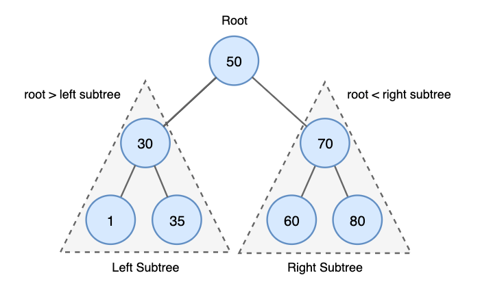
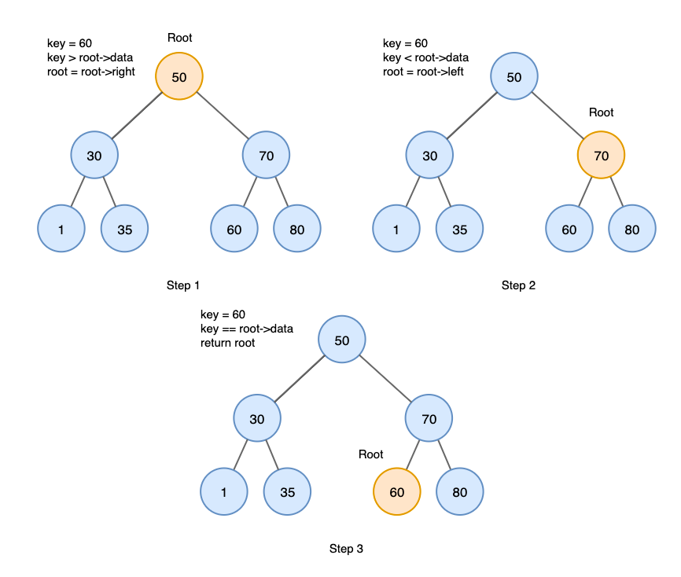
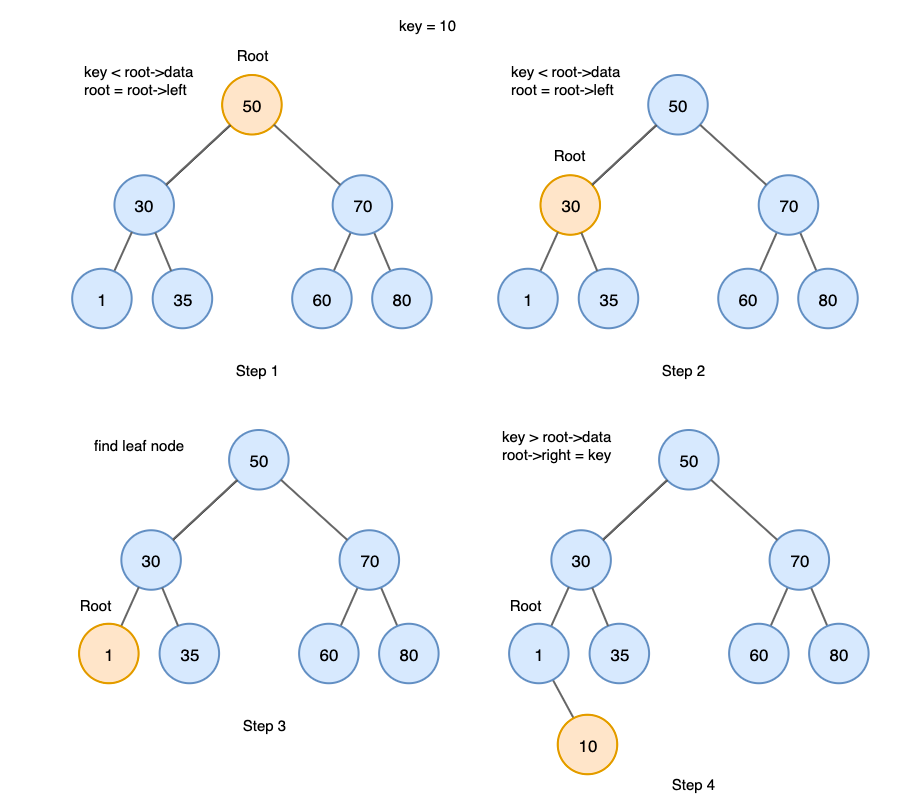
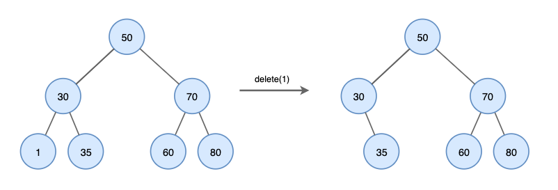
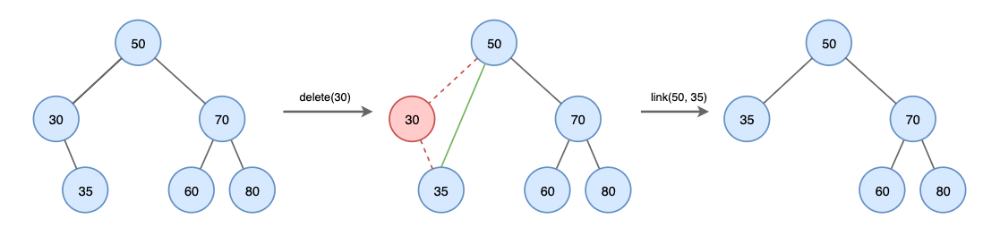
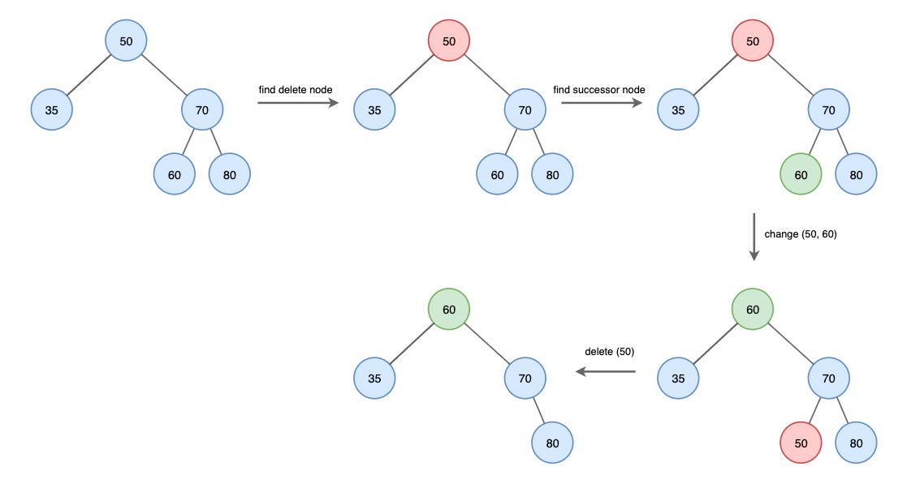

# 이진 탐색 트리(Binary Search Tree; BST)

## Binary Search Tree의 정의
이진 탐색 트리(Binary Search Tree)는 `탐색을 위한 이진 트리 기반의 자료구조`이다.
모든 왼쪽 자식의 값이 루트나 부모보다 작고, 모든 오른쪽 자식의 값이 루트나 부모보다 큰 값을 가지는 특징을 가진다. 또한 모든 노드는 중복된 값을 가지지 않는다.
이러한 특성 때문에 효율적인 검색이 가능하다.

## Binay Search Tree의 연산
### 탐색(Search)
이진 트리에서 특정 요소의 위치를 찾는다.  
탐색 과정은 다음과 같다.
1. 루트에서 시작
2. 탐색할 값을 루트와 비교, 루트보다 작으면 왼쪽으로 재귀, 크다면 오른쪽으로 재귀
3. 목표값을 찾을 때까지 절차를 반복
4. 목표값이 없다면 null 반환

### 삽입(Insert)
이진 트리에 데이터를 삽입한다. 중복은 허용하지 않고 데이터는 항상 리프 노드에 삽입된다.  
삽입 과정은 다음과 같다.
1. 루트에서 시작
2. 삽입할 값을 루트와 비교, 루트보다 작으면 왼쪽으로 재귀, 크다면 오른쪽으로 재귀
3. 리프 노드에 도달한 후 삽입할 값이 리프 노드보다 작으면 왼쪽에, 크다면 오른쪽에 삽입

### 삭제(Delete)
이진 트리에서 특정 노드를 삭제한다. 여기에는 세가지 상황이 있다.

**1. 삭제할 노드가 리프 노드인 경우**  
이 경우 노드를 삭제하기만 하면 된다.

**2. 삭제할 노드에 자식 노드가 하나인 경우**  
노드를 삭제한 후 자식 노드를 삭제된 노드의 부모에 직접 연결한다.

**3. 삭제할 노드에 자식 노드가 두개인 경우**  
자식 노드가 두개인 경우 `successor 노드`를 찾는 과정이 추가된다.  
`successor 노드`란 right subtree의 최솟값을 의미한다. 즉 inorder 순회에서 다음 노드를 의미한다.

삭제 과정은 다음과 같다.
1. 삭제할 노드를 찾는다.
2. 삭제할 노드의 successor 노드를 찾는다.
3. 삭제할 노드와 successor 노드의 위치를 바꾼 후 삭제할 노드를 삭제한다.

 

___
### `Reference`
[DataStructure: Binary Searach Tree][link]

[link]: https://yoongrammer.tistory.com/71

[//]: # (나중에 자바코드로 다시 구현해보자.⭐️)
[//]: # (https://banjjak1.tistory.com/54?category=978276)