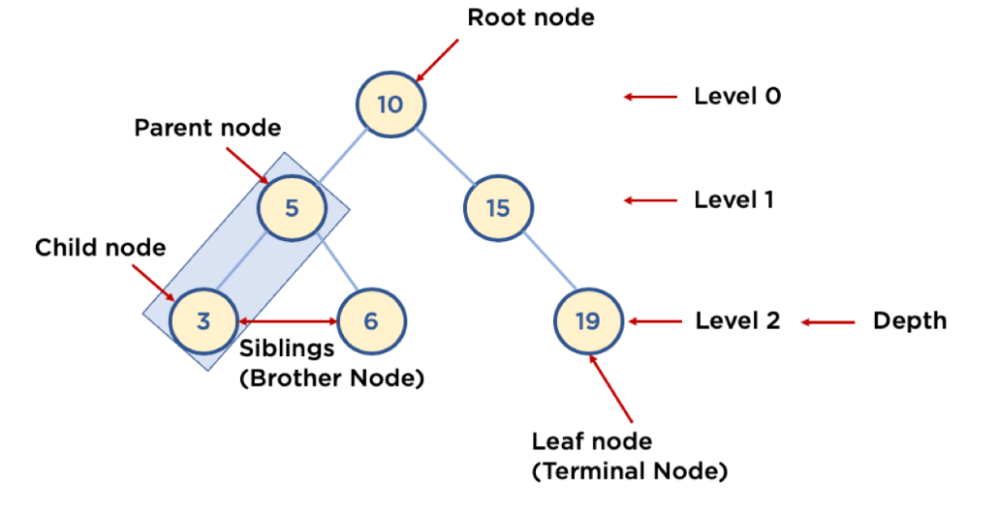

# 트리(Tree)
___

## Tree의 정의
자료구조 Tree는 이름 그대로 나무의 형태를 가지고 있다. 그래프의 여러 구조 중 `단방향 그래프`의 한 구조로, 
하나의 뿌리로부터 가지가 사방으로 뻗은 형태가 나무와 닮아 있다고 해서 트리 구조라 부른다.

트리 구조는 `데이터가 바로 아래에 있는 하나 이상의 데이터에 무방향으로 연결된 계층적 자료구조`이다.
또한, 하나의 데이터가 아래에 여러 개의 데이터가 존재할 수 있는 `비선형 구조`이다. 즉 계층적으로 표현이 되고, 아래로만 뻗어나가기 때문에 `사이클이 없다`.

트리 구조는 `루트(Root)` 라는 하나의 꼭짓점 데이터를 시작으로, 여러 개의 데이터들을 `간선(edge)`으로 연결한다. 각 데이터를 `노드(Node)`라고 하며, 두 개의 노드가 상하 계층으로 연결이 된다면 부모 / 자식 관계를 가진다.
위 그림에서 5는 3와 6의 `부모 노드(Parent Node)`이고, 3와 6는 5의 `자식 노드(Child Node)`이다. 19와 같이 자식이 없는 노드는 나무의 잎과 같다 하여 `리프 노드(Leaf Node)`라고 부른다.

## Tree와 구조와 특징
### 깊이(Depth), 레벨(Level)
`루트로부터 하위 계층의 특정 노드까지의 깊이(depth)`를 표현한다. 또한 `같은 깊이를 가지고 있는 노드를 묶어서 레벨(level)`로 표현할 수 있다.
지면에 있는 `루트 노드(depth는 0, level 또한 0)을 기준`으로 한 층씩 내려가며 depth와 level이 1씩 상승한다. 그리고 같은 level에 나란히 있는 노드를 `형제 노드(Siblings, Brother Node)`라 한다.

### 높이(Height)
`리프 노드를 기준으로 루트까지의 높이(height)`를 표현한다. 즉, 리프 노드와 직간접적으로 연결된 노드의 높이를 표현하며, 부모 노드는 자식 노드의 가장 높은 height 값에 +1한 값을 높이로 가진다. 위의 그림에서 3, 6, 19의 높이는 0, 5, 15의 높이는 1, 10의 높이는 2이다.

### 서브 트리(Sub tree)
트리 구조의 루트에서 뻗어나온 큰 트리의 내부에, 트리 구조를 갖춘 작은 트리를 `서브 트리(Sub tree)`라 한다. 위의 그림에서 (5, 3, 6)으로 이루어진 작은 트리를 예시로 들 수 있겠다.
 
[//]: # (## Binary Search Tree&#40;BST&#41;)
