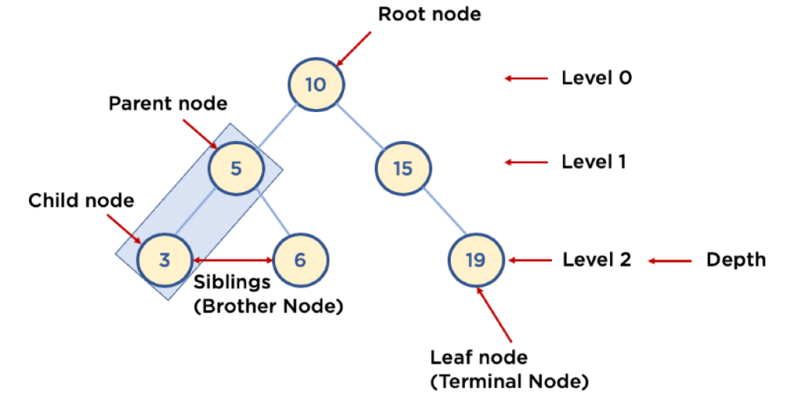
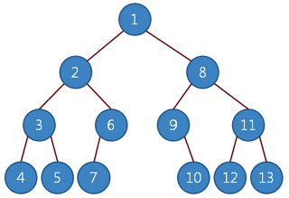
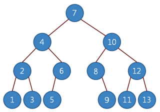
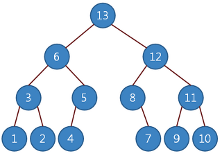
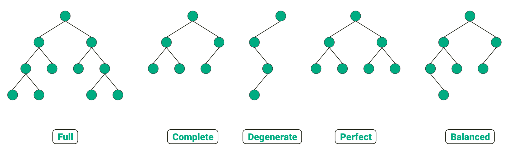

# 트리(Tree)
___

## Tree의 정의
자료구조 Tree는 이름 그대로 나무의 형태를 가지고 있다. 그래프의 여러 구조 중 `단방향 그래프`의 한 구조로, 
하나의 뿌리로부터 가지가 사방으로 뻗은 형태가 나무와 닮아 있다고 해서 트리 구조라 부른다.



트리 구조는 `루트(Root)` 라는 하나의 꼭짓점 데이터를 시작으로, 여러 개의 데이터들을 `간선(edge)`으로 연결한다. 각 데이터를 `노드(Node)`라고 하며, 두 개의 노드가 상하 계층으로 연결이 된다면 부모 / 자식 관계를 가진다.
위 그림에서 5는 3와 6의 `부모 노드(Parent Node)`이고, 3와 6는 5의 `자식 노드(Child Node)`이다. 19와 같이 자식이 없는 노드는 나무의 잎과 같다 하여 `리프 노드(Leaf Node)`라고 부른다.

트리 구조는 일반적으로 대상 정보의 각 항목들을 계층적으로 구조화할 때 사용하는 `비선형 자료구조`이다. 또한 트리 구조는 '데이터 저장' 보다는 `저장된 데이터를 더 효과적으로 탐색`하기 위해 사용된다.
또한 `사이클이 없고`, 루트 노드를 제외한 모든 노드는 단 하나의 부모 노드를 가진다.

## Tree의 구조와 특징

### 깊이(Depth), 레벨(Level)
`루트로부터 하위 계층의 특정 노드까지의 깊이(depth)`를 표현한다. 또한 `같은 깊이를 가지고 있는 노드를 묶어서 레벨(level)`로 표현할 수 있다.
지면에 있는 `루트 노드(depth는 0, level 또한 0)을 기준`으로 한 층씩 내려가며 depth와 level이 1씩 상승한다. 그리고 같은 level에 나란히 있는 노드를 `형제 노드(Siblings, Brother Node)`라 한다.

### 높이(Height)
`리프 노드를 기준으로 루트까지의 높이(height)`를 표현한다. 즉, 리프 노드와 직간접적으로 연결된 노드의 높이를 표현하며, 부모 노드는 자식 노드의 가장 높은 height 값에 +1한 값을 높이로 가진다. 위의 그림에서 3, 6, 19의 높이는 0, 5, 15의 높이는 1, 10의 높이는 2이다.

### 서브 트리(Sub tree)
트리 구조의 루트에서 뻗어나온 큰 트리의 내부에, 트리 구조를 갖춘 작은 트리를 `서브 트리(Sub tree)`라 한다. 위의 그림에서 (5, 3, 6)으로 이루어진 작은 트리를 예시로 들 수 있겠다.

## Tree Traversal
특정 목적을 위해 트리의 모든 구조를 한 번씩 방문하는 것을 `트리 순회(Tree Traversal)`라고 한다.
트리를 순회하는 방법에는 세 가지 종류가 있다. 이 때, 트리 구조에서 노드를 순차적으로 조회할 때 항상 왼쪽에서 오른쪽으로 조회한다.

[이미지 출처][traverse]

[traverse]: https://www.hooni.net/xe/study/66487#prettyPhoto

### 1. 전위 순회(preorder traverse)
루트 노드 -> 왼쪽 노드 -> 오른쪽 노드



```
public ArrayList<Integer> preorderTree(Node root, int depth, ArrayList<Integer> list) {

  if (root != null) {
    list.add(root.getData());
    preorderTree(root.getLeft(), depth + 1, list);
    preorderTree(root.getRight(), depth + 1, list);
  }
  return list;
}
```
### 2. 중위 순회(inorder traverse)
왼쪽 노드 -> 루트 노드 -> 오른쪽 노드




```
public ArrayList<Integer> inorderTree(Node root, int depth, ArrayList<Integer> list) {

  if (root != null) {
    inorderTree(root.getLeft(), depth + 1, list);
    list.add(root.getData());
    inorderTree(root.getRight(), depth + 1, list);
  }
  return list;
}
```

### 3. 후위 순회(postorder traverse)
왼쪽 노드 -> 오른쪽 노드 -> 루트 노드



```
public ArrayList<Integer> postorderTree(Node root, int depth, ArrayList<Integer> list) {
  
  if (root != null) {
    postorderTree(root.getLeft(), depth + 1, list);
    postorderTree(root.getRight(), depth + 1, list);
    list.add(root.getData());
  }
  return list;
}
```

<br>

## Binary Tree
트리 자료구조에는 여러가지 유형이 있는데, 그 중 가장 기본이 되는 트리는 `이진 트리(Binary Tree)` 구조이다.
이진 트리는 자식 노드가 최대 두 개인 노드들로 구성되어 있다. 이 두개의 노드는 왼쪽 또한, 이진 트리는 자료의 삽입과 삭제 방법에 따라 `정 이진 트리(Full binary tree)`, `완전 이진 트리(Complete binary tree)`, `포화 이진 트리(Perfect binary tree)` 등으로 나뉜다.




- **정 이진트리(Full binary tree)**  
  각 내부 노드가 0개 혹은 2개의 자식 노드를 갖는 트리이다.


- **완전 이진 트리(Complete binary tree)**  
마지막 레벨을 제외하고 모든 노드가 가득 차 있어야 하며, 마지막 레벨의 노드는 전부 차 있지 않아도 되지만 왼쪽이 채워져야 한다.
이진 힙(Heap)은 이진 트리의 중요한 에시다.


- **포화 이진 트리(Perfect binary tree)**  
정 이진 트리이면서 완전 이진 트리인 경우를 말한다.
모든 리프 노드의 깊이와 레벨이 동일하고, 모든 내부 노드에 2개의 자식이 있다.
높이가 H인 포화 이진 트리의 총 노드 수는 `2^(H+1)-1` 개다.


- **균형 이진 트리(Balanced binary tree)**  
왼쪽 자식과 오른쪽 자식 노드의 갯수가 일치해야 할 필요는 없지만 지나치게 한쪽으로 치우치지 않은 트리 구조이다.
트리가 한 쪽으로 치우쳐져 있는 경우, 시간 복잡도가 악화되므로 노드의 삽입과 삭제마다 트리의 구조를 재조정하는 과정을 거치는 알고리즘을 통해 이 문제를 해결할 수 있다.  
균형 인수( = 왼쪽 서브 높이 - 오른쪽 서브 높이의 절댓값 )의 값이 2 이상인 경우 트리 재조정이 필요하다.


- **변질 이진 트리(Degenerate binary tree)**  
각 부모 노드가 오직 한 개의 자식 노드를 갖는 트리이다. 이는 성능 면에서 트리가 연결 리스트 데이터 구조처럼 동작하는 것을 의미한다.

<br>

___
### `Reference`
[Different Types of Binary Tree with colourful illustrations][binarytree]

[binarytree]: https://towardsdatascience.com/5-types-of-binary-tree-with-cool-illustrations-9b335c430254