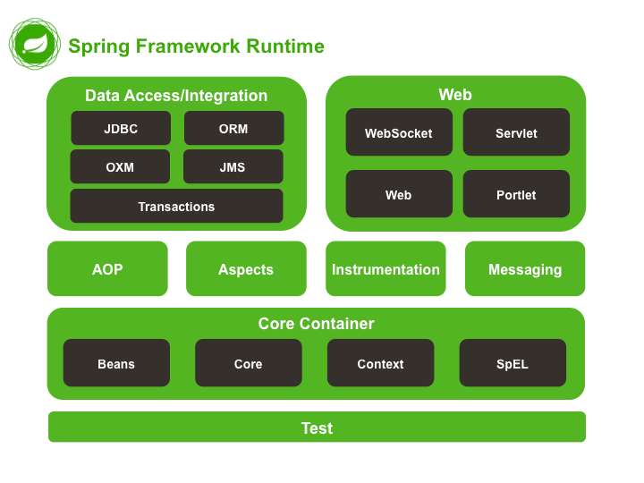
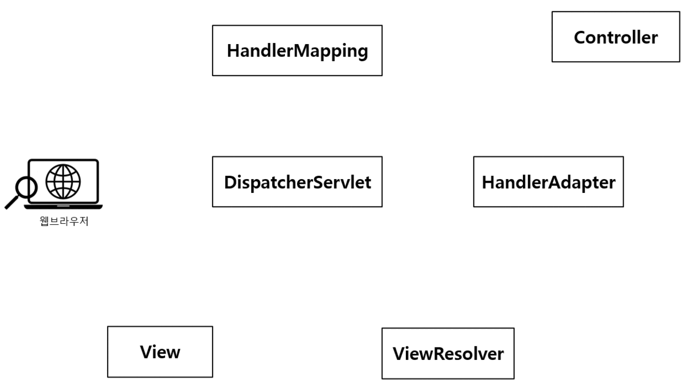

# API Layer - 1. Architecture

___

## Spring MVC란?

  
출처 : https://docs.spring.io/spring-framework/docs/5.0.0.M5/spring-framework-reference/html/overview.html

위 그림에서 알 수 있듯이, Spring에서 지원하는 모든 기능들을 포함한 것을 `Spring Framework`라고 한다.

Spring의 모듈 중에는 Web 계층을 담당하는 몇 가지 모듈이 있는데, 그 중에서 Servlet API를 기반으로 클라이언트의 요청을 처리하는 모듈을 `spring-webmvc`라고 한다. 이 때 개발자들 사이에서는 `Spring Web MVC`, `Spring MVC`, `Spring MVC Framework`를 같은 뜻으로 사용한다.

먼저, Spring MVC가 무엇을 의미할까? 지금 당장은 `두 가지`만 기억하면 된다.
- Spring MVC는 클라이언트의 요청을 편리하게 처리해주는 프레임워크다.
- 앞으로 만들 Sample Application은 Spring MVC가 제공해주는 기능을 이용해서 만든다.

> 서블릿(Servlet)이란?
>
> 서블릿은 클라이언트의 요청을 처리하도록 특정 규약에 맞춰서 Java 코드로 작성하는 클래스 파일이다.  
> 그리고 아파치 톰캣(Apache Tomcat)은 서블릿이 웹 애플리케이션으로 실행되도록 해주는 서블릿 컨테이너(Servlet Container) 중 하나다.  
> 즉, Spring MVC 내부에서는 서블릿을 기반으로 웹 애플리케이션이 동작한다는 사실을 기억하자.

<br>

### Model
Model은 Spring MVC에서 `M`에 해당한다.

Spring MVC 기반의 웹 애플리케이션은 클라이언트의 요청을 전달 받으면 요청 사항을 처리하기 위한 작업을 한다. 이렇게 처리한 작업의 결과 데이터를 클라이언트에게 응답으로 돌려줘야 하는데, 이 때 클라이언트에게 응답으로 돌려주는 작업의 처리 결과 데이터를 `Model`이라한다.

> 서비스 계층(Service Layer) : 클라이언트의 요청 사항을 구체적으로 처리하는 영역  
> 비즈니스 로직(Business Logic): 실제로 요청 사항을 처리하기 위해 Java 코드로 구현한 것

<br>

### View
View는 Spring MVC에서 `V`에 해당한다.

View는 앞서 설명한 `Model 데이터를 이용하여 웹브라우저 같은 클라이언트 애플리케이션의 화면에 보여지는 리소스(Resource)를 제공하는 역할`을 한다.

Spring MVC에는 다양한 View 기술이 포함되어 있는데, View의 형태는 아래와 같이 나눌 수 있다.
- HTML 페이지 출력
    - 클라이언트 애플리케이션에서 보여지는 HTML 페이지를 직접 렌더링하여 클라이언트에 전송하는 방식이다.
    - 즉, 기본적인 HTMl 태그로 구성된 페이지에 Model 데이터를 넣은 후, 최종적인 HTML 페이지를 만들어서 클라이언트 측에 전송한다.
    - Spring MVC에서 지원하는 HTML 페이지 출력 기술에는 Thymeleaf, FreeMarker, JSP+JSTL, Tiles 등이 있다.
- PDF, Excel 등의 문서 형태로 출력
    - Model 데이터를 가공해서 PDF 문서나 Excel 문서로 만들어서 클라이언트에 전송하는 방식이다.
    - 문서 내에서 데이터가 동적으로 변경되어야 하는 경우 사용할 수 있다.
- XML, JSON 등 특정 형식의 포맷으로 변환
    - Model 데이터를 특정 프로토콜 형태로 변환해서 변환된 데이터를 클라이언트에 전송하는 방식이다.
    - 이 방식은 특정 형식의 데이터만 전송하고, 프론트엔드 측에서 이 데이터를 기반으로 HTML 페이지를 만드는 방식이다.
        - 프론트엔드 영역과 백엔드 영역이 명확하게 구분되므로 개발 및 유지보수가 상대적으로 용이하다.
        - 프론트엔드 측에서 비동기 클라이언트 애플리케이션을 만드는 것이 가능해진다.

> JSON(JavaScript Object Notation)은 클라이언트 애플리케이션과 서버 애플리케이션이 주고 받는 데이터 형식이다.  
> 과거에는 XMl 형식의 데이터가 많이 사용되었으나, 현재는 XML 보다 상대적으로 가볍고, 복잡하지 않은 JSON 형식을 대부분 사용한다.
>
> JSON 기본 포맷 : {"속성":"값"}

<br>

### Controller
Controller는 Spring MVC에서 `C`에 해당한다.

Controller는 클라이언트의 요청을 직접적으로 전달 받는 엔드포인트(End Point)로써 Model과 View 중간에서 상호 작용해주는 역할을 한다. 즉, `클라이언트의 요청을 받아 비즈니스 로직을 거친 후 Model 데이터가 만들어지면, 이 Model 데이터 View로 전달하는 역할`을 한다.

```
@RestController
@RequestMapping(path = "/v1/coffee")
public class CoffeeController {                 
    private final CoffeeService coffeeService;

    CoffeeController(CoffeeService coffeeService) {
        this.coffeeService = coffeeService;
    }

    @GetMapping("/{coffee-id}")  // (1)
    public Coffee getCoffee(@PathVariable("coffee-id") long coffeeId) {
        return coffeeService.findCoffee(coffeeId); // (2)
    }
}
```

(1) `@GetMapping` 애노테이션을 통해 클라이언트의 요청을 받는다.  
(2) CoffeeService 클래스의 `findCoffee()` 메서드를 호출해 비즈니스 로직을 처리한다. 이 때 리턴 받는 Coffee가 `Model 데이터`다.
그리고 getCoffee() 에서 이 Model 데이터를 리턴하는데, 이 Model 데이터를 Spring의 `View`가 전달받아서 `JSON 형식`으로 변경한 후 클라이언트에 전송한다.

> [Spring MVC의 동작방식]
>
> Client가 요청 데이터 전송  
> → Controller가 요청 데이터 수신 → 비즈니스 로직 처리 → Model 데이터 생성  
> → Controller에게 Model 데이터 전달 → Controller가 View에게 Model 데이터 전달  
> → View가 응답 데이터 생성

<br>

## Spring MVC 동작 방식



위 그림은 클라이언트가 요청을 전송했을 때, Spring MVC가 내부적으로 이 요청을 처리하는 방식을 보여준다.

(1) 먼저 클라이언트가 `DispatcherServlet 클래스`에 요청을 전송한다.

(2) `DispatcherServlet`은 클라이언트의 요청을 처리할 Controller에 대한 검색을 HandlerMapping 인터페이스에게 요청한다.

(3) `HandlerMapping`은 클라이언트 요청과 매핑되는 Controller 정보를 다시 DispatcherServlet에게 리턴해줍니다.
> Controller 정보에는 해당 Controller 안에 있는 **Handler 메서드** 정보를 포함하고 있다.  
> **Handler 메서드**는 Controller 클래스 안에 구현된 요청 처리 메서드를 의미한다.

(4) 요청을 처리할 Controller 클래스를 찾았으니 이제는 **실제로 클라이언트 요청을 처리할 Handler 메서드**를 찾아서 호출해야 한다. DispatcherServlet은 Handler 메서드를 직접 호출하지 않고, HandlerAdpater에게 Handler 메서드 호출을 위임한다.

(5) `HandlerAdapter`는 DispatcherServlet으로부터 전달 받은 Controller 정보를 기반으로 해당 Controller의 Handler 메서드를 호출한다.

전체 처리 흐름의 끝이다. 이제부터는 반대로 되돌아간다.

(6) Controller의 `Handler 메서드`는 비즈니스 로직 처리 후 리턴 받은 Model 데이터를 HandlerAdapter에게 전달한다.

(7) `HandlerAdapter`는 전달받은 Model 데이터와 View 정보를 다시 DispatcherServlet에게 전달한다.

(8) `DispatcherServlet`은 전달 받은 View 정보를 다시 ViewResolver에게 전달해서 View 검색을 요청한다.

(9) `ViewResolver`는 View 정보에 해당하는 View를 찾아서 View를 다시 리턴해준다.

(10) `DispatcherServlet`은 ViewResolver로부터 전달 받은 View 객체를 통해 Model 데이터를 넘겨주면서 클라이언트에게 전달할 응답 데이터 생성을 요청한다.

(11) `View`는 응답 데이터를 생성해서 다시 DispatcherServlet에게 전달한다.

(12) `DispatcherServlet`은 View로부터 전달 받은 응답 데이터를 최종적으로 클라이언트에게 전달한다.

> [DispatcherServlet의 역할]
>
> 클라이언트로부터 요청을 받은 **DispatcherServlet**은 HandlerMapping, HandlerAdapter, ViewResolver, View 등 Spring MVC의 구성 요소들에게 요청에 대한 처리를 위임(Delegate)하고 있다.  
> "HandlerMapping아 Handler Controller 좀 찾아줄래? → ViewResolver야 View 좀 찾아줄래? → View야 Model 데이터를 합쳐서 컨텐츠 좀 만들어 줄래?" 처럼 말이다.  
> 이처럼 DispatcherServlet이 애플리케이션의 가장 앞단에 배치되어 다른 구성요소들과 상호작용하면서 클라이언트의 요청을 처리하는 패턴을 **Front Controller Pattern**이라고 한다.

[링크][Link]를 통해 Handler, Adapter, ViewResolver의 의미에 대해 조금 더 공부해보자.

[Link]: https://itvillage.tistory.com/entry/Spring-MVC의-동작-방식-추가-설명