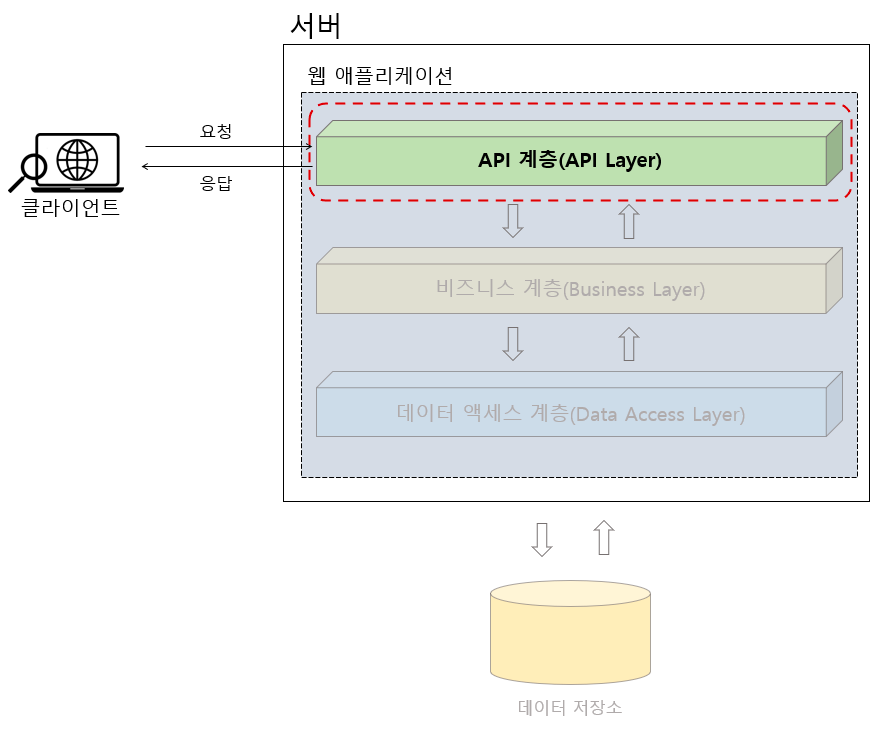
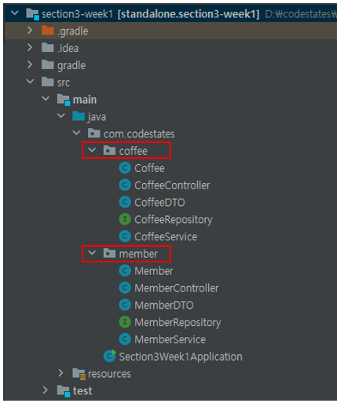
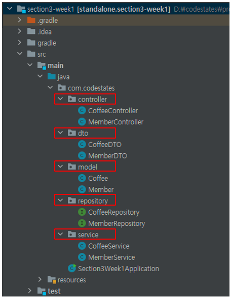

# API Layer - 2. Controller

---

API 계층(API Layer)은 `클라이언트의 요청을 직접적으로 전달 받는 계층`이다.

여기서는 이 API 계층을 Spring MVC 기반의 코드로 구현해 볼 것이다.

앞서 설명한 `Spring MVC의 동작 방식`에서 알 수 있듯이, Controller 클래스는 Spring MVC에서 `클라이언트 요청의 최종 목적지`다.

 

우리가 제작할 샘플 애플리케이션은 클라이언트 측에서 커피 주문을 위해 필요한 정보를 제공하기 위한 `서버용 웹 애플리케이션`이다.

애플리케이션을 제작하기 위해서 실질적으로 제일 먼저 해야되는 일은 `애플리케이션의 경계를 설정하는 것`과 `애플리케이션 기능 구현을 위한 요구 사항을 수집`하는 일이다.

사실 프랜차이즈 매장에서 고객이 주문할 수 있는 메뉴로 커피 이외에 햄버거, 콜라, 감자 튀김, 피자, 주스 등등 굉장히 많은것들이 있을텐데, 우리는 학습을 위해서 다양한 메뉴 중에서 **커피**만 주문할 수 있는 것으로 기능을 제한할 것이다.  
이처럼 요구사항에 맞춰서 어떤 애플리케이션의 기능을 특정 범위로 제한하는 것을 `애플리케이션 경계를 설정`한다고 한다.

고객이 스마트폰 앱을 통해 커피를 주문하기 위해 어떤 `기능`이 필요할까?
- 커피 주문에 필요한 기능 예
  - 커피 자체에 대한 정보(Coffee)
  - 이 커피를 주문하는 고객의 정보(Member)
  - 고객이 주문하려는 커피의 주문 정보(Order)  

기본적으로 이 세가지 정보만으로도 고객은 커피를 주문하고, 주문된 커피를 마실 수 있다.

## 패키지 구조 생성

그 다음으로 해야할 일은 `Java 패키지 구조`를 잡는 것이다.

Spring Boot 기반의 애플리케이션에서 주로 사용되는 Java 패키지 구조는 `기능 기반 패키지 구조(package-by-feature)`와 `계층 기반 패키지 구조(package-by-layer)`가 있다.

 

### 기능 기반 패키지 구조(package-by-feature)
말 그대로 애플리케이션의 패키지를 `애플리케이션에서 구현해야 하는 기능`을 기준으로 패키지를 구성하는 것이다.
이렇게 나누어진 패키지 안에는 **하나의 기능을 완성하기 위한 계층별(API 계층, 서비스 계층, 데이터 액세스 계층)클래스**들이 모여있다.

위 그림은 회원을 관리하기 위한 `회원 기능`을 `member` 패키지, 커피를 관리하기 위한 `커피 기능`을 `coffee` 패키지로 나누었으며, 각각의 패키지 안에 레이어 별 클래스들이 존재한다.

### 계층 기반 패키지 구조(package-by-layer)
패키지를 하나의 계층(Layer)로 보고 클래스들을 계층별로 묶어서 관리하는 구조다.

위 그림에서 ‘controller, dto’ 패키지는 `API 계층`에 해당되고, ‘model, service’ 패키지는 `비즈니스 계층`에 해당되며, repository는 `데이터 액세스 계층`에 해당된다.

> 위 두가지 패키지 구조는 애플리케이션의 요구 사항이나 특성에 따라서 상황에 맞게 적절하게 사용하면 된다.
> 
> 그러나, Spring Boot에서는 리팩토링과 테스트가 용이하고, 향후 마이크로 서비스 시스템으로 분리가 상대적으로 용이한 **기능 기반 패키지 구조(package-by-feature)** 사용을 권장한다.

    