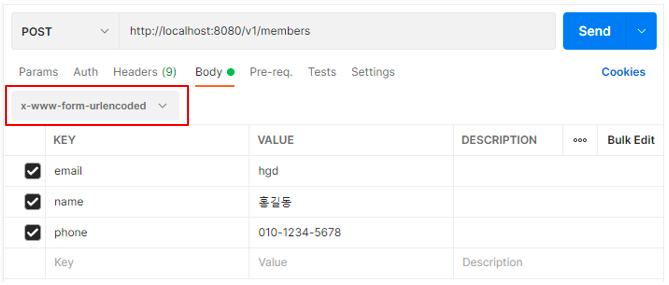
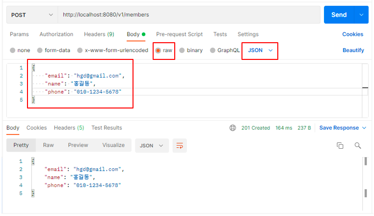
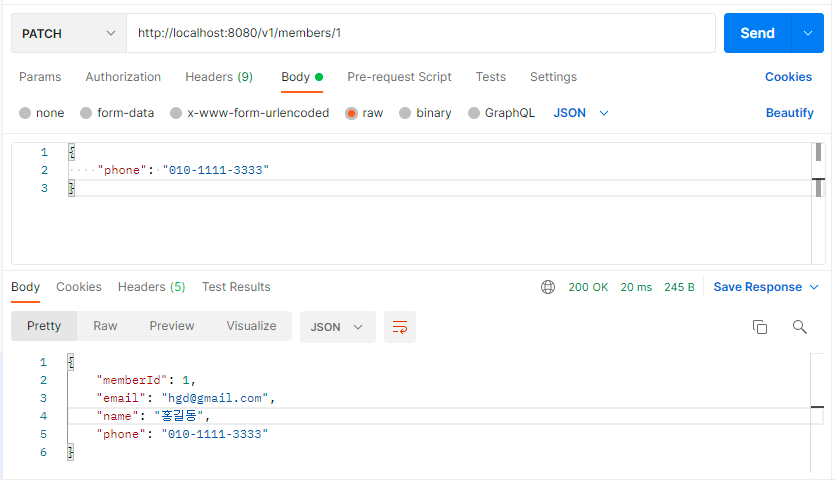

# API Layer - 3. DTO

---

## DTO란?
DTO는 `Data Transfer Object`의 약자로, Martin Fowler가  ‘Patterns of Enterprise Application Architecture’ 라는 책에서 처음 소개한 엔터프라이즈 애플리케이션 아키텍처 패턴의 하나다.

**Transfer**라는 이름에서도 알 수 있듯이 `데이터를 전송하기 위한 용도의 객체` 정도로 생각할 수 있다.

즉, 클라이언트에서 서버 쪽으로 전송하는 `요청 데이터`, 서버에서 클라이언트 쪽으로 전송하는 `응답 데이터`의 형식으로 클라이언트와 서버 간에 데이터 전송이 이루어지는데, 이 구간에서 DTO를 사용할 수 있다.

<br>

## DTO가 필요한 이유
`2.Controller`에서 작성한 MemberController 클래스의 일부를 통해 DTO가 필요한 이유를 알아보자.

```
@RestController
@RequestMapping("/v1/members")
public class MemberController {
    @PostMapping
    public ResponseEntity postMember(@RequestParam("email") String email,
                                     @RequestParam("name") String name,
                                     @RequestParam("phone") String phone) {
        Map<String, String> map = new HashMap<>();
        map.put("email", email);
        map.put("name", name);
        map.put("phone", phone);

        return new ResponseEntity<Map>(map, HttpStatus.CREATED);
    }

		...
		...
}
```
### 1. 코드의 간결성
위 코드에서는 회원 정보를 저장하기 위해서 총 3개의 `@RequestParam`을 사용하고 있다. 하지만 현업에서는 더 많은 정보들이 회원 정보에 포함되어 있을 수 있다. 이 경우 `클라이언트의 요청 데이터를 하나의 객체로 모두 전달받을 수 있다면` 코드 자체가 훨씬 간결해 질 수 있다. 여기서 `DTO 클래스`가 요청 데이터를 하나의 객체로 전달 받는 역할을 한다.

위 코드에 DTO 클래스를 적용해보자.
```
@RestController
@RequestMapping("/v1/members")
public class MemberController {
    @PostMapping
    public ResponseEntity postMember(MemberDto memberDto) {
        return new ResponseEntity<MemberDto>(memberDto, HttpStatus.CREATED);
    }

		...
		...
}
```
`@RequestParam` 대신 `MemberDto memberDto`가 추가되었다.
그리고 @RequestParam을 통해 전달받은 요청 데이터들을 Map에 추가하는 로직이 사라지고, `MemberDto` 객체를 `ResponseEntity 클래스의 생성자 파라미터`로 전달하도록 변경하였다.
이처럼 DTO 클래스를 사용하니 코드 자체가 간결해졌다.

### 2. 데이터 유효성(Validation) 검증의 단순화
위 Controller의 핸들러 메서드는 클라이언트의 요청 데이터에 대한 유효성 검증 작업을 거치지 않았다.

예를 들면, 클라이언트 쪽에서 회원 정보의 email 주소를 'abc@gmail.com' 같은 이메일 주소 형식이 아닌 'abc' 같은 단순 문자열로 전송해도 핸들러 메서드 쪽에서 정상적으로 전달 받을 수 있다.

이처럼 서버 쪽에서 유효한 데이터를 전달 받기 위해 데이터를 검증하는 것을 `유효성(Validation) 검증`이라고 한다.

이 때, HTTP 요청을 전달 받는 핸들러 메서드는 요청을 전달 받는 것이 주 목적이기 때문에 최대한 간결하게 작성되는 것이 좋다. 그러므로 `DTO 클래스`에 `유효성 검증 로직`을 담아 핸들러 메서드의 간결함을 유지하는 것이 좋다.

```
public class MemberDto {
    @Email
    private String email;
    private String name;
    private String phone;

    public String getEmail() {
        return email;
    }

    public void setEmail(String email) {
        this.email = email;
    }

    public String getName() {
        return name;
    }

    public void setName(String name) {
        this.name = name;
    }

    public String getPhone() {
        return phone;
    }

    public void setPhone(String phone) {
        this.phone = phone;
    }
}
```
email 멤버변수에 `@Email`을 추가하면 클라이언트의 요청 데이터에 유효한 이메일 주소가 포함되어있지 않을 경우 유효성 검증에 실패하기 때문에 클라이언트의 요청이 거부된다.

MemberDto 클래스에서 이메일에 대한 유효성을 검증하므로, MemberController의 postMember() 핸들러 메서드는 아래의 코드와 같이 간결해진다.
```
@RestController
@RequestMapping("/v1/members")
public class MemberController {
    @PostMapping
    public ResponseEntity postMember(@Valid MemberDto memberDto) {
        return new ResponseEntity<MemberDto>(memberDto, HttpStatus.CREATED);
    }

		...
		...
}
```
postMember() 핸들러 메서드의 파라미터인 MemberDto 앞에 붙은 `@Valid`는 MemberDto 객체에 유효성 검증을 적용하게 해주는 어노테이션이다.

DTO 클래스를 사용하는 가장 주된 목적은 HTTP 요청의 수를 줄이기 위함이다. 그리고 도메인 객체 분리라는 또 다른 목적이 있지만, 아직 서비스 계층에 대한 학습이 진행되지 않았기 때문에 나중에 다시 설명하기로 하자.

## HTTP 요청/응답 데이터에 DTO 적용하기
MemberController의 핸들러 메서드에 DTO 클래스를 적용해보자.

### HTTP Request Body가 JSON 형식이 아닌 경우
`2. Controller` 챕터에서 클라이언트에 전달하는 요청 데이터는 `x-www-form-urlencoded` 형식의 데이터였다.



하지만 현업에서 프론트엔드와 백엔드 개발자가 하나의 제품이나 서비스를 제작할 경우, 프론트엔드 쪽 웹앱과 백엔드 쪽 애플리케이션의 기본 API 통신 프로토콜은 대부분 JSON이 될 것이다.

> 지금까지 클라이언트 쪽에서 전달되는 데이터를 `요청 데이터`라고 불렀지만, 이제부터는 요청 데이터 중 바디에 해당하는 데이터는 `Request Body`라는 정확한 표현을 사용할 것이다.  
> 
> JSON 형식이 아닌 Request Body를 전달 받는 방식과 JSON 형식의 Request Body를 전달 받는 방식은 @RequestBody를 추가하느냐 그렇지 않느냐 외에 큰 차이점이 없다.

### HTTP Request Body가 JSON 형식일 경우
`2. Controller` 챕터에서 작성된 `MemberController` 코드를 보면서 HTTP Request Body에 DTO를 적용할 부분을 먼저 살펴보자.

```
import org.springframework.http.ResponseEntity;
import org.springframework.web.bind.annotation.*;

import java.util.HashMap;
import java.util.Map;

@RestController
@RequestMapping("/v1/members")
public class MemberController {
    // 회원 정보 등록
    @PostMapping
    public ResponseEntity postMember(@RequestParam("email") String email,
                                     @RequestParam("name") String name,
                                     @RequestParam("phone") String phone) {
        Map<String, String> body = new HashMap<>();
        body.put("email", email);
        body.put("name", name);
        body.put("phone", phone);

        return new ResponseEntity<Map>(body, HttpStatus.CREATED);
    }

    // 회원 정보 수정
    @PatchMapping("/{member-id}")
    public ResponseEntity patchMember(@PathVariable("member-id") long memberId,
                                      @RequestParam String phone) {
        Map<String, Object> body = new HashMap<>();
        body.put("memberId", memberId);
        body.put("email", "hgd@gmail.com");
        body.put("name", "홍길동");
        body.put("phone", phone);

        // No need Business logic

        return new ResponseEntity<Map>(body, HttpStatus.OK);
    }
    
    // 한명의 회원 정보 조회
    @GetMapping("/{member-id}")
    public ResponseEntity getMember(@PathVariable("member-id") long memberId) {
        System.out.println("# memberId: " + memberId);

        // not implementation
        return new ResponseEntity<Map>(HttpStatus.OK);
    }

    // 모든 회원 정보 조회
    @GetMapping
    public ResponseEntity getMembers() {
        System.out.println("# get Members");

        // not implementation

        return new ResponseEntity<Map>(HttpStatus.OK);
    }
    
    // 회원 정보 삭제
    @DeleteMapping("/{member-id}")
    public ResponseEntity deleteMember(@PathVariable("member-id") long memberId) {
        // No need business logic

        return new ResponseEntity(HttpStatus.NO_CONTENT);
    }
}
```

> DTO 클래스 적용을 위한 리팩토링 절차는 다음과 같다.
> - 회원 정보를 전달 받을 DTO 클래스를 생성한다.
>   - MemberCotroller에서 현재 회원 정보로 전달 받는 각 데이터 항목(email, name, phone)들을 DTO 클래스의 멤버 변수로 추가한다.
> - 클라이언트 쪽에서 전달하는 요청 데이터를 `@RequestParam`으로 전달 받는 핸들러 메서드를 찾는다.
>  - Request Body가 필요한 핸들러는 HTTP POST, PATCH, PUT 같이 리소스의 추가나 변경이 발생할 때이다. HTTP GET은 리소스를 조회하는 용도이기 때문에 필요 없다.
>  - 결국 `@PostMapping`, `@PatchMapping`이 붙은 핸들러 메서드를 찾는 것과 동일하다.
> - `@RequestParam`쪽 코드를 DTO 클래스의 객체로 수정한다.
> - Map 객체로 작성되어 있는 Response Body를 DTO 클래스의 객체로 변경한다.

<br>

**✔️ MemberPostDto 및 MemberPatchDto 클래스 생성**  
코드 리팩토링 절차에 따라 회원정보에 대한 DTO 클래스를 생성한다.
```
public class MemberPostDto {
    private String email;
    private String name;
    private String phone;

    public String getEmail() {
        return email;
    }

    public String getName() {
        return name;
    }

    public String getPhone() {
        return phone;
    }
}
```
위 코드는 회원 정보 등록 시, Request Body를 전달 받을 때 사용하기 위한 `MemberPostDto 클래스`다.
```
public class MemberPatchDto {
    private long memberId;
    private String name;
    private String phone;

    public String getName() {
        return name;
    }

    public void setName(String name) {
        this.name = name;
    }

    public String getPhone() {
        return phone;
    }

    public void setPhone(String phone) {
        this.phone = phone;
    }

    public long getMemberId() {
        return memberId;
    }

    public void setMemberId(long memberId) {
        this.memberId = memberId;
    }
}
```
위 코드는 회원 정보 수정 시, Request Body를 전달 받을 때 사용하기 위한 `MemberPatchDto 클래스`다.

> DTO 클래스를 만들 때, 주의해야 할 부분은 멤버 변수 이외에 각 멤버 변수에 해당하는 getter 메서드가 있어야 한다는 것이다.  
> 만약 getter 메서드가 없으면 Response Body에 해당 멤버 변수의 값이 포함되지 않는 문제가 발생한다. 

<br>

**✔️ MemberController에 DTO 클래스 적용**
```
import com.codestates.member.MemberPatchDto;
import com.codestates.member.MemberPostDto;
import org.springframework.http.HttpStatus;
import org.springframework.http.ResponseEntity;
import org.springframework.stereotype.Controller;
import org.springframework.web.bind.annotation.*;

@RestController
@RequestMapping("/v1/members")
public class MemberController {
    // 회원 정보 등록
    @PostMapping
    public ResponseEntity postMember(@RequestBody MemberPostDto memberPostDto) {
        return new ResponseEntity<>(memberPostDto, HttpStatus.CREATED);
    }

    // 회원 정보 수정
    @PatchMapping("/{member-id}")
    public ResponseEntity patchMember(@PathVariable("member-id") long memberId,
                                      @RequestBody MemberPatchDto memberPatchDto) {
        memberPatchDto.setMemberId(memberId);
        memberPatchDto.setName("홍길동");

        // No need Business logic

        return new ResponseEntity<>(memberPatchDto, HttpStatus.OK);
    }

    // 한명의 회원 정보 조회
    @GetMapping("/{member-id}")
    public ResponseEntity getMember(@PathVariable("member-id") long memberId) {
        System.out.println("# memberId: " + memberId);

        // not implementation
        return new ResponseEntity<>(HttpStatus.OK);
    }

    // 모든 회원 정보 조회
    @GetMapping
    public ResponseEntity getMembers() {
        System.out.println("# get Members");

        // not implementation

        return new ResponseEntity<>(HttpStatus.OK);
    }

    // 회원 정보 삭제
    @DeleteMapping("/{member-id}")
    public ResponseEntity deleteMember(@PathVariable("member-id") long memberId) {
        // No need business logic

        return new ResponseEntity(HttpStatus.NO_CONTENT);
    }
}
```
위 코드에서는 `@RequestParam` 대신에 DTO 클래스를 사용해서 `postMember()`에서는 `MemberDto`, `patchMember()`에서는 `MemberPatchDto` 클래스의 객체를 통해서 Request Body를 한번에 전달 받음으로써 코드가 간결해졌다.

`Postman`에서 MemberController의 postMember()와 patchMember()를 실행해보자.



Response Body의 결과는 JSON 형식이다. 그런데 위 코드에서 전달 받는 HTTP Request Body가 JSON 형식이어야 하기 때문에 클라이언트 쪽에서 전달하는 Request Body 역시 JSON 형식으로 입력해야 한다.



postMember() 호출 때와 마찬가지로 수정하고자 하는 phone 번호를 JSON 형식으로 전달하고 있다.

> **@RequestBody** 
> 
> 위 코드에서 MemberPostDto 클래스 앞에 붙은 @RequestBody는 JSON 형식의 Request Body를 MemberPostDto 클래스의 객체로 변환시켜 주는 역할을 한다.  
> 즉, 클라이언트 측에서 전송하는 Request Body가 JSON 형식이어야 한다는 말이다.  
> 만약 JSON 형식이 아닌 다른 형식의 데이터를 전송한다면, Spring 내부에서 'Unsupported Media Type'과 같은 에러 메시지를 포함한 응답을 전달한다.
> 
> **@ResponseBody**
> 
> @RequestBody의 역할이 클라이언트 측에서 전송한 JSON 형식의 Request Body를 DTO 클래스의 객체로 변환하는 것이라면, **@ResponseBody**는 JSON 형식의 Response Body를 클라이언트에게 전달하기 위해 DTO 클래스의 객체를 Response Body로 변환하는 역할을 한다.

그런데 postMember(), patchMember()에는 `@ResponseBody`를 사용하는 곳이 없다.  
이유는 바로 postMember(), patchMember()의 핸들러 메서드의 리턴 값이 `ResponseEntity` 클래스의 객체이기 때문이다.

Spring MVC에서는 **핸들러 메서드에 @ResponseBody가 붙거나 핸들러 메서드의 리턴 값이 ResponseEntity일 경우**, 내부적으로 `HttpMessageConverter`가 동작하게 되어 응답 객체를 JSON 형식으로 바꾸어 준다.

> **JSON의 직렬화(Serialization)과 역직렬화(Deserialization)**
> 
> 클라이언트 측에서 JSON 형식의 데이터를 서버 쪽으로 전달하면 서버 쪽의 웹 애플리케이션은 전달 받은 JSON 형식의 데이터를 DTO 같은 Java의 객체로 변환하는데, 이를 역직렬화(**Deserialization**)라 한다.
> 
> 반면에 서버 쪽에서 클라이언트에게 응답 데이터를 전송하기 위해서 DTO와 같은 Java의 객체를 JSON 형식으로 변환하는 것을 직렬화(**Serialization**)라고 한다.
> 
> JSON 직렬화(Serialization): Java 객체 → JSON  
> JSON 역직렬화(Deserialization): JSON → Java 객체
>
> **DTO 클래스의 대표적인 단점**  
> 우리가 위에서 살펴본 DTO 클래스는 MemberController에 해당되는 MemberPostDto와 MemberPatchDto다. 그런데 Controller 클래스에는 CoffeeController와 OrderController도 있으므로 각각 두개의 DTO 클래스를 추가적으로 작성해야 한다.  
> 즉, Controller 클래스가 늘어남에 따라 DTO 클래스가 두 배(ex.xxxxPostDto, xxxxPatchDto)씩 늘어날 것이다.
> 
> 여기서는 DTO 클래스가 무엇인지, DTO 클래스를 기본적으로 어떻게 사용할 수 있는지에 집중하자.