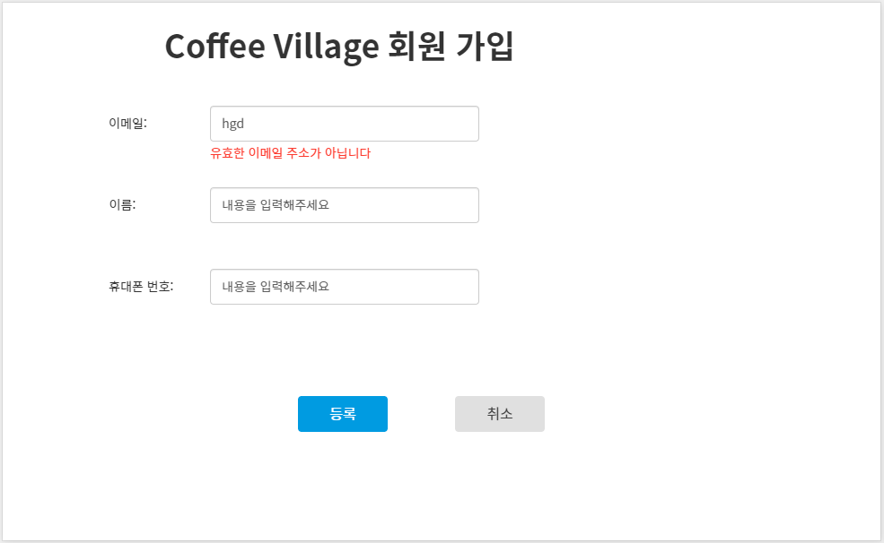

# DTO 유효성 검증(Validation)
___

## DTO 유효성 검증이 필요한 이유
먼저 우리가 만드는 Sample Application과 REST API 통신을 하는 프론트엔드 쪽 웹 앱이 아래 그림과 같다고 가정하자.


일반적으로 프론트엔드 쪽 웹사이트에서는 `JavaScript`를 이용해서 사용자가 입력하는 입력 폼 필드 값에 대해 1차적으로 유효성 검증을 진행한다.



위 그림처럼 잘못된 형식의 이메일 주소를 입력하면 프론트엔드 쪽에서 1차적으로 먼저 유효성 검사를 진행한 후에 사용자에게 이를 알려준다. 하지만 프론트엔드 쪽에서 유효성 검사를 통과하였다 하더라도 그 값이 반드시 유효한 값이라고 보장할 수는 없다.

> 위 그림에서 유효성 검사를 통과한 뒤 [등록] 버튼을 누르면 서버 쪽으로 HTTP Request 요청이 전송될 것이다.
> 
> 하지만 JavaScrpit로 전송되는 데이터는 브라우저의 **개발자 도구**를 사용해서 브레이크 포인트(break point)를 건 뒤에  얼마든지 그 값을 조작할 수 있기 때문에 프론트엔드 쪽에서 유효성 검사를 진행했다고 하더라도 서버 쪽에서 한번 더 유효성 검사를 진행해야 된다.
> 
> 즉, 프론트엔드 쪽에서 진행되는 유효성 검사는 **사용자의 편의성**에 초점이 맞춰져 있다고 생각하면 될 것이다.

<br>

## DTO 클래스에 유효성 검증 적용하기
MemberController에서 사용된 `MemberPostDto` 클래스와 `MemberPatchDto` 클래스에 유효성 검증을 적용해보자.

<br>

### 유효성 검증을 위한 의존 라이브러리 추가
DTO 클래스에 유효성 검증을 적용하기 위해서는 Spring Boot에서 지원하는 `Starter`가 필요하다.
build.gradle 파일의 dependencies 항목에 다음 코드를 추가하자.
```
dependencies {
	implementation 'org.springframework.boot:spring-boot-starter-validation'
	...
	...
}
```

<br>

### MemberPostDto 유효성 검증
**✔️ MemberPostDto 유효성 검증 요구 사항**
- email
  - 값이 비어있지 않거나 공백이 아니어야 한다.
  - 유효한 이메일 주소 형식이어야 한다.
- name
  - 값이 비어있지 않거나 공백이 아니어야 한다.
- phone
  - 값이 비어있지 않거나 공백이 아니어야 한다.
  - 010으로 시작하는 11자리 숫자와 ‘-’로 구성된 문자열이어야 합니다.
    - ex) 010-1234-5678

<br>

먼저 유효성 검증 요구 사항에 맞춰 MemberPostDto 클래스에 유효성 검증을 적용해보자.

```
import javax.validation.constraints.Email;
import javax.validation.constraints.NotBlank;
import javax.validation.constraints.Pattern;

public class MemberPostDto {
    @NotBlank
    @Email
    private String email;

    @NotBlank(message = "이름은 공백이 아니어야 합니다.")
    private String name;

    @Pattern(regexp = "^010-\\d{3,4}-\\d{4}$",
            message = "휴대폰 번호는 010으로 시작하는 11자리 숫자와 '-'로 구성되어야 합니다.")
    private String phone;

    public String getEmail() {
        return email;
    }

    public void setEmail(String email) {
        this.email = email;
    }

    public String getName() {
        return name;
    }

    public void setName(String name) {
        this.name = name;
    }

    public String getPhone() {
        return phone;
    }

    public void setPhone(String phone) {
        this.phone = phone;
    }
}
```

MemberPostDto의 각 멤버변수에 적용된 `애노테이션`을 보자.
- email
  - `@NotBlank`
    - 이메일 정보가 비어있지 않은지를 검증한다.
    - null 값이나 공백(””), 스페이스(” “) 같은 값들을 모두 허용하지 않는다.
    - 유효성 검증에 실패하면 에러 메시지가 콘솔에 출력 된다.
  - `@Email`
    - 유효한 이메일 주소인지를 검증합니다.
    - 유효성 검증에 실패하면 내장된 `디폴트 에러 메시지`가 콘솔에 출력됩니다.
- name
  - `@NotBlank`
    - 이름 정보가 비어있지 않은지를 검증합니다.
    - null 값이나 공백(””), 스페이스(” “) 같은 값들을 모두 허용하지 않는다.
    - 유효성 검증에 실패하면 @NotBlank 의 `message 애트리뷰트`에 지정한 문자열이 에러 메시지로 콘솔에 출력된다.
- phone
  - @Pattern
    - 휴대폰 정보가 `정규표현식(Reqular Expression)`에 매치되는 유효한 번호인지를 검증한다.
    - 유효성 검증에 실패하면 내장된 디폴트 에러 메시지가 콘솔에 출력된다.

요청으로 전달받는 MemberPostDto 클래스의 각 멤버변수에 유효성 검증을 위한 어노테이션을 추가함으로써 MemberController의 핸들러 메서드에 별도의 유효성 검증을 추가하지 않고 깔끔하게 `유효성 검증 로직을 분리`했다.

> [정규 표현식(Regular Expression)][Link]

[Link]: https://codechacha.com/ko/java-regex/

유효성 검증 애노테이션을 추가한 MemberPostDto 클래스를 사용하는 MemberController 클래스의 `postMember() 핸들러 메서드 코드`는 다음과 같다.

```
@RestController
@RequestMapping("/v1/members")
public class MemberController {
    @PostMapping
    public ResponseEntity postMember(@Valid @RequestBody MemberPostDto memberDto) {
        return new ResponseEntity<>(memberDto, HttpStatus.CREATED);
    }
		...
		...
}
```

유효성 검증 애노테이션이 추가된 DTO 클래스에서 유효성 검증 로직이 실행되게 하기 위해서는 위 코드의 postMember()와 같이 DTO 클래스에 `@Valid`를 추가해야 한다.

이제 `Postman`으로 postMember() 핸들러 메서드에 요청을 전송해보자.


email, name, phone 정보를 모두 유효하지 않은 정보로 입력해서 postMember() 핸들러 메서드로 요청을 전송했다.

응답 결과는 Response Status : 400 인 `Bad Request`를 전달받았다.

아래 코드는 `Spring MVC에서 출력한 로그`이다.

```
2022-06-25 16:14:11.700  WARN 63997 --- [nio-8080-exec-1] .w.s.m.s.DefaultHandlerExceptionResolver : Resolved
[org.springframework.web.bind.MethodArgumentNotValidException: Validation failed for argument [0] in public
org.springframework.http.ResponseEntity
com.codestates.member.MemberController.postMember(com.codestates.member.MemberPostDto)
// ⬇️ 바로 아래의 3 errors를 주목하자.
with 3 errors: [Field error in object 'memberPostDto' on field 'name': rejected value []; codes [NotBlank.memberPostDto.
name,NotBlank.name,NotBlank.java.lang.String,NotBlank]; arguments [org.springframework.context.support.DefaultMessageSourceResolvable:
codes [memberPostDto.name,name]; arguments []; default message [name]]; default message [이름은 공백이 아니어야 합니다.]] [Field error in object 
'memberPostDto' on field 'email': rejected value [hgd@]; codes [Email.memberPostDto.email,Email.email,Email.java.lang.String,Email]; 
arguments [org.springframework.context.support.DefaultMessageSourceResolvable: codes [memberPostDto.email,email]; arguments []; 
default message [email],[Ljavax.validation.constraints.Pattern$Flag;@4827b411,.*]; default message [올바른 형식의 이메일 주소여야 합니다]] 
[Field error in object 'memberPostDto' on field 'phone': rejected value [010-1233-21341]; codes [Pattern.memberPostDto.phone,Pattern.phone,Pattern.
java.lang.String,Pattern]; arguments [org.springframework.context.support.DefaultMessageSourceResolvable: codes [memberPostDto.phone,phone]; arguments []; 
default message [phone],[Ljavax.validation.constraints.Pattern$Flag;@2a552084,^010-\d{3,4}-\d{4}$]; default message [휴대폰 번호는 010으로 시작하는 11자리 숫자와 '-'로 구성되어야 합니다.]] ]
```

로그를 보면 유효성 검증에서 총 3개의 검증 에러를 발견했다는 사실을 알 수 있다.

> Postman에서 전달 받은 Response Body의 내용만으로는 클라이언트 쪽에서 전송한 요청 데이터 중에서 어떤 항목이 유효성 검증에 실패했는지 알 수 없다.  
> Spring MVC에서 로그를 출력해주지만, 클라이언트 입장에서는 여전히 불친절한 메시지를 받을 수 밖에 없다.  
> 이 부분은 친절한 응답 메시지를 클라이언트에 전달되도록 **예외 처리**할 때 바꿔보자.  
> 지금은 DTO 클래스에 유효성 검증 애너테이션을 추가해서 Request Body의 유효성 검증을 깔끔하게 할 수 있다는 사실에 집중하자.

<br>

### MemberPatchDto 유효성 검증
**✔️ MemberPatchDto 유효성 검증 요구 사항**

- name (이름)
  - 값이 비어있을 수 있다.
  - 값이 비어있지 않다면 공백이 아니어야 한다.
- phone (휴대폰 번호)  
  - 값이 비어있을 수 있다.
  - 010으로 시작하는 11자리 숫자와 ‘-’로 구성된 문자열이어야 한다.
    - ex) 010-1234-5678

<br>

```
import javax.validation.constraints.Pattern;

public class MemberPatchDto {
    private long memberId;

    @Pattern(regexp = "^(?=\\s*\\S).*$", message = "회원 이름은 공백이 아니어야 합니다.")
    private String name;

    @Pattern(regexp = "^(?=\\s*\\S).*$", message = "전화 번호는 공백이 아니어야 합니다.")
    @Pattern(regexp = "^010-\\d{3,4}-\\d{4}$",
            message = "휴대폰 번호는 010으로 시작하는 11자리 숫자와 '-'로 구성되어야 합니다.")
    private String phone;

    public String getName() {
        return name;
    }

    public void setName(String name) {
        this.name = name;
    }

    public String getPhone() {
        return phone;
    }

    public void setPhone(String phone) {
        this.phone = phone;
    }

    public long getMemberId() {
        return memberId;
    }

    public void setMemberId(long memberId) {
        this.memberId = memberId;
    }
}
```
유효성 검증 요구 사항에 맞춰 MemberPatchDto 클래스에 유효성 검증을 적용해보았다.

MemberPatchDto의 각 멤버변수에 적용된 `애노테이션`을 보자.
- memberId
  - Request Body에 포함되는 데이터가 아니므로 유효성 검증이 필요하지 않다.
- name
  - @Pattern
    - 정규 표현식으로 다음 내용을 체크한다.
      - 이름 정보가 비어 있으면 검증에 성공한다.
      - 이름 정보가 비어 있지 않고, 공백 문자열이라면 검증에 실패한다.
- phone
  - @Pattern
    - 정규 표현식으로 다음 내용을 체크한다.
      - 휴대폰 정보가 비어있으면 검증에 성공한다.
      - 휴대폰 정보가 비어 있지 않고, 010으로 시작하는 11자리 숫자와 ‘-’로 구성된 문자열이 아니라면 검증에 실패한다.

MemberPostDto 클래스와 달리 MemberPatchDto에서는 모두 `정규 표현식`을 사용했다. 정규 표현식은 `다양한 조건을 선택적으로 검증할 때 사용`한다.

> name 멤버 변수에 사용한 “`^(?=\\s*\\S).*$`” 정규 표현식을 보자.
> - ‘`^`’은 문자열의 시작을 의미합니다.  
> - ‘`$`’는 문자열의 끝을 의미합니다.
> - ‘`*`’는 ‘*’ 앞에서 평가할 대상이 0개 또는 1개 이상인지를 평가합니다.
> - ‘`\s`’는 공백 문자열을 의미합니다.
> - ‘`\S`’ 공백 문자열이 아닌 나머지 문자열을 의미합니다.
> - ‘`.`’은 임의의 문자 하나를 의미합니다.
> 
> 즉, “`^(?=\\s*\\S).*$`”은 ‘`공백이 없고, 문자열이 있는 경우`’, '`공백이 있고, 문자열이 있는 경우`’ 외에 단순히 공백만 있는 문자열은 검증에 실패하도록 해준다.

유효성 검증 애너테이션을 추가한 MemberPatchDto 클래스를 사용하는 MemberController 클래스의 `patchMember() 핸들러 메서드의 코드`는 다음과 같다.

```
@RestController
@RequestMapping("/v1/members")
@Validated
public class MemberController {
    
    ...
    ...

    @PatchMapping("/{member-id}")
    public ResponseEntity patchMember(@PathVariable("member-id") long memberId,
                                    @Valid @RequestBody MemberPatchDto memberPatchDto) {
        memberPatchDto.setMemberId(memberId);

        // No need Business logic

        return new ResponseEntity<>(memberPatchDto, HttpStatus.OK);
    }
}
```

MemberPostDto 클래스에서와 마찬가지로 MemberPatchDto 클래스에서도 유효성 검증 로직이 실행되도록 `@Valid`를 추가해야한다.

이제 `Postman`으로 patchMember() 핸들러 메서드에 요청을 전송해보자.


name은 공백 문자열을, phone은 유효하지 않은 휴대폰 번호로 입력해서 요청을 전송했다.

당연하게도 Response Status : 400인 `Bad Request`를 전달 받았다.

<br>

## 쿼리 파라미터(Query Parameter 또는 Query String) 및 @Pathvariable에 대한 유효성 검증
지금까지 Request Body의 유효성 검사를 진행해보았는데, 검증 대상에서 빠진 항목이 하나 있다.
그것은 바로 patchMember() 핸들러 메서드의 URI path에서 사용되는 `@PathVariable("member-id") long memberId` 변수다.

여기에 `1 이상의 숫자여야 한다`라는 제약 조건을 걸어보자.
```
@RestController
@RequestMapping("/v1/members")
@Validated   // (1)
public class MemberController {
		...
		...

    @PatchMapping("/{member-id}")
    public ResponseEntity patchMember(@PathVariable("member-id") @Min(1) long memberId,
                                    @Valid @RequestBody MemberPatchDto memberPatchDto) {
        memberPatchDto.setMemberId(memberId);

        // No need Business logic

        return new ResponseEntity<>(memberPatchDto, HttpStatus.OK);
    }
}
```
위 코드에서는 `@PathVariable("member-id") long memberId`에 **1 이상의 숫자일 경우에만** 유효성 검증에 통과하도록 `@Min(1)` 이라는 검증 애너테이션을 추가했다. 여기서 끝나지 않고, @PathVariable이 추가된 변수에 유효성 검증이 정상적으로 수행되게 하기 위해서 `(1)`과 같이 클래스 레벨에 `@Validated`를 붙여 주었다.


위 그림은 patchMember() 핸들러 메서드 요청 URI에 유효하지 않은 숫자인 0을 입력한 후 요청을 전달했고, 그 결과 Response Status가 500인 `Internal Server Error`를 전달받았다.
`@RequestBody`에 대한 유효성 검증 실패 메시지와 조금 다르기는하지만 어쨌든 유효성 검증은 정상적으로 이루어졌다.

Spring MVC에서 출력한 로그는 다음과 같다.
```
javax.validation.ConstraintViolationException: patchMember.memberId: 1 이상이어야 합니다
	at org.springframework.validation.beanvalidation.MethodValidationInterceptor.invoke(MethodValidationInterceptor.java:120) ~[spring-context-5.3.19.jar:5.3.19]
	at org.springframework.aop.framework.ReflectiveMethodInvocation.proceed(ReflectiveMethodInvocation.java:186) ~[spring-aop-5.3.19.jar:5.3.19]
	at org.springframework.aop.framework.CglibAopProxy$CglibMethodInvocation.proceed(CglibAopProxy.java:763) ~[spring-aop-5.3.19.jar:5.3.19]
	at org.springframework.aop.framework.CglibAopProxy$DynamicAdvisedInterceptor.intercept(CglibAopProxy.java:708) ~[spring-aop-5.3.19.jar:5.3.19]
	at com.codestates.member.MemberController$$EnhancerBySpringCGLIB$$98e731c.patchMember(<generated>) ~[main/:na]
	at java.base/jdk.internal.reflect.NativeMethodAccessorImpl.invoke0(Native Method) ~[na:na]
	at java.base/jdk.internal.reflect.NativeMethodAccessorImpl.invoke(NativeMethodAccessorImpl.java:62) ~[na:na]
	at java.base/jdk.internal.reflect.DelegatingMethodAccessorImpl.invoke(DelegatingMethodAccessorImpl.java:43) ~[na:na]
	at java.base/java.lang.reflect.Method.invoke(Method.java:566) ~[na:na]
        ....
        ....
```
위 로그를 보면 첫 번째 라인에서 `ConstraintViolationException`이 발생하면서 유효성 검증이 정상적으로 진행이 된 것을 확인할 수 있다.

<br>

## Jakarta Bean Validation이란?

## Custom Validator를 사용한 유효성 검증
