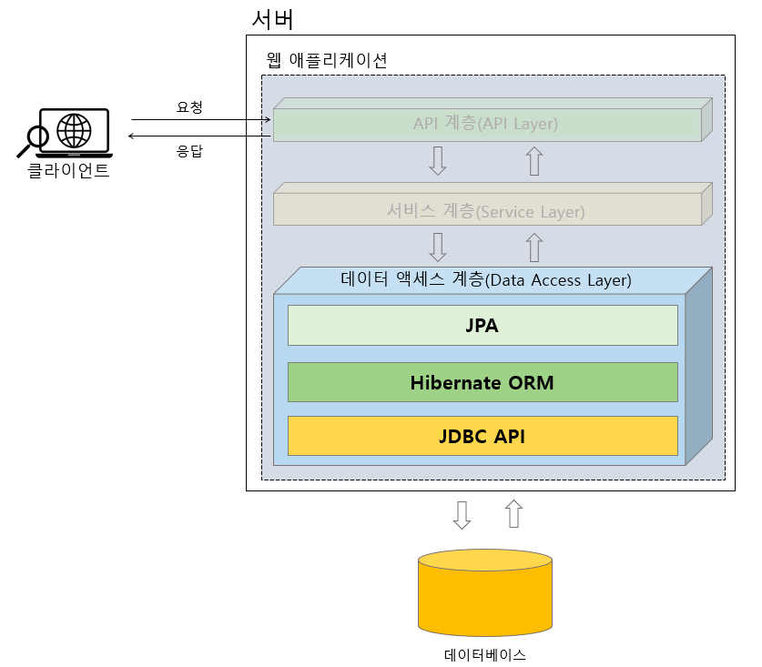
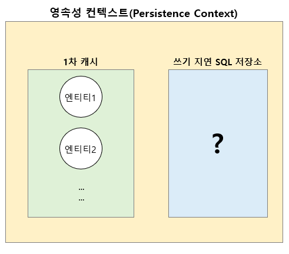
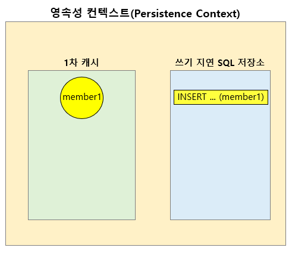

# JPA
___

## JPA란?
JPA(Java Persistence API)는 Java 진영에서 사용하는 `ORM(Object-Relational Mapping)` 기술의 표준 사양(또는 명세, Specification)이다.

표준 사양이라는 의미는 Java의 인터페이스로 사양이 정해져 있기 때문에 JPA라는 표준 사양을 구현한 구현체는 따로 있다는 뜻이다.

즉, JPA 표준 사양을 구현한 구현체로는 Hibernate ORM, EclipseLink, DataNucleus 등이 있는데, 여기서는 `Hibernate ORM`에 대해서 학습할 것이다.

Hibernate ORM은 JPA에서 정의해둔 인터페이스를 구현한 구현체로서, JPA에서 지원하는 기능 이외에 Hibernate 자체적으로 사용할 수 있는 API 역시 지원하고 있다.

> JPA는 Java Persistence API의 약자이지만, 현재는 Jakarta Persistence라고도 불린다.
 
<br>

## 데이터 액세스 계층에서의 JPA 위치



JPA는 위 그림과 같이 데이터 액세스 계층의 상단에 위치한다. 데이터 저장, 조회 등의 작업은 JPA를 거쳐 JPA의 구현체인 Hibernate ORM을 통해서 이루어지며, Hibernate ORM은 내부적으로 JDBC API를 이용해서 데이터베이스에 접근하게 된다.

<br>

## JPA에서 P(Persistence)의 의미
Persistence는 영속성, 지속성이라는 뜻을 가지고 있다. 즉, 무언가를 오래 지속되게 한다라는 것이 Persistence의 목적이다.

### 영속성 컨텍스(Persistence Context)
`ORM`은 객체(Object)와 데이터베이스 테이블의 매핑을 통해 엔티티 클래스 객체 안에 포함된 정보를 테이블에 저장하는 기술이다. 
`JPA`에서는 테이블과 매핑되는 엔티티 객체 정보를 `영속성 컨텍스트`라는 곳에 보관해서 애플리케이션 내에 오래 지속되도록 한다.
그리고 이렇게 보관된 엔티티 정보는 데이터베이스 테이블에 데이터를 저장, 수정, 조회, 삭제하는데 사용된다.



위 그림과 같이 영속성 컨텍스트에는 `1차 캐시`와 `쓰기 지연 SQL 저장소`라는 영역이 있다.
JPA API 중에서 엔티티 정보를 영속성 컨텍스트에 저장(persist)하는 API를 사용하면 영속성 컨텍스트의 1차 캐시에 엔티티 정보가 저장된다.

### JPA API로 영속성 컨텍스트 이해하기
**✔ JPA API를 사용하기 위한 사전 준비**
- build.gradle 설정
```
dependencies {
	implementation 'org.springframework.boot:spring-boot-starter-web'
	implementation 'org.springframework.boot:spring-boot-starter-data-jpa' // (1)
	compileOnly 'org.projectlombok:lombok'
	runtimeOnly 'com.h2database:h2'
	annotationProcessor 'org.projectlombok:lombok'
	testImplementation 'org.springframework.boot:spring-boot-starter-test'
}
```
(1)과 같이 spring-boot-starter-data-jpa를 추가하면 기본적으로 Spring DATA JPA 기술을 포함해서 JPA API를 사용할 수 있다.

> Spring Data JPA가 아닌 JPA API만 사용하고 싶다면 JPA 관련 라이브러리를 별도로 추가해야 하지만, 여기서의 목적은 JPA API의 동작을 손쉽게 확인하는 것이 주 목적이기 때문에 건너뛰도록 한다.

- JPA 설정(application.yml)
```
spring:
  h2:
    console:
      enabled: true
      path: /h2     
  datasource:
    url: jdbc:h2:mem:test
  jpa:
    hibernate:
      ddl-auto: create  # (1) 스키마 자동 생성
    show-sql: true      # (2) SQL 쿼리 출력
```
(1)과 같이 설정을 추가해주면 JPA에서 사용하는 엔티티 클래스를 정의하고, 애플리케이션 실행시 이 엔티티와 매핑되는 테이블을 데이터베이스에 자동으로 생성해준다.

즉, Spring Data JDBC에서는 schema.sql 파일을 이용해 테이블 생성을 위한 스키마를 직접 지정해주어야 했지만, JPA에서는 (1)의 설정을 추가하면 JPA가 자동으로 데이터베이스에 테이블을 생성해준다.

(2)와 같이 설정을 추가해주면 JPA의 동작 과정을 이해하기 위해 JPA API를 통해서 실행되는 SQL 쿼리를 로그로 출력해준다.

- 샘플 코드 실행을 위한 Configuration 클래스 생성
```
import org.springframework.boot.CommandLineRunner;
import org.springframework.context.annotation.Bean;
import org.springframework.context.annotation.Configuration;

import javax.persistence.EntityManager;
import javax.persistence.EntityManagerFactory;
import javax.persistence.EntityTransaction;

// (1)
@Configuration
public class JpaBasicConfig {
    private EntityManager em;
    private EntityTransaction tx;

    // (2)
    @Bean
    public CommandLineRunner testJpaBasicRunner(EntityManagerFactory emFactory) {
        this.em = emFactory.createEntityManager();
        this.tx = em.getTransaction();

        return args -> {
            // (3) 
        };
    }
}
```
(1)과 같이 특정 클래스에 `@Configuration`을 추가하면 Spring에서 Bean 검색 대상인 Configuration 클래스로 간주하여 (2)와 같이 `@Bean`이 추가된 메서드를 검색한 후, 해당 메서드에서 리턴하는 객체를 Spring Bean으로 추가해준다.

(3)과 같이 `CommandLineRunner` 객체를 람다 표현식으로 정의해주면 애플리케이션 부트스트랩 과정이 완료된 후 이 람다 표현식에 정의한 코드를 실행한다.

여기에 JPA API를 사용하여 코드를 작성하고 애플리케이션을 실행시켜 JPA의 동작 과정을 알아보자.

<br>

**✔ 영속성 컨텍스트에 엔티티 저장**
```
import lombok.Getter;

import javax.persistence.*;

@Getter
@Setter
@NoArgsConstructor
@Entity  // (1)
public class Member {
    @Id  // (2)
    @GeneratedValue  // (3)
    private Long memberId;

    private String email;

    public Member(String email) {
        this.email = email;
    }
}
```
JPA에서 사용하기 위한 Member 엔티티 클래스이다.

(1)과 (2)와 같이 `@Entity`와 `@Id`를 추가하면 JPA에서 해당 클래스를 엔티티 클래스로 인식한다.

(3)의 `@GeneratedValue`은 식별자를 생성해주는 역할을 한다. 지금은 식별자에 해당하는 멤버변수에 @GeneratedValue를 추가하면 데이터베이스 테이블에서 기본키가 되는 식별자를 자동으로 설정해준다 정도로 알고 넘어가자.

```
import org.springframework.boot.CommandLineRunner;
import org.springframework.context.annotation.Bean;
import org.springframework.context.annotation.Configuration;

import javax.persistence.EntityManager;
import javax.persistence.EntityManagerFactory;
import javax.persistence.EntityTransaction;

@Configuration
public class JpaBasicConfig {
    private EntityManager em;
    private EntityTransaction tx;

    @Bean
    public CommandLineRunner testJpaBasicRunner(EntityManagerFactory emFactory) { // (1)
        this.em = emFactory.createEntityManager();  // (2)

        return args -> {
            Member member1 = new Member("hgd@gmail.com");
        
            // (3)
            em.persist(member1);

            // (4)
            Member resultMember = em.find(Member.class, 1L);
            System.out.println("Id: " + resultMember.getMemberId() + ", email: " + 
                    resultMember.getEmail());
        };
    }
}
```
위 코드는 Member 엔티티 클래스의 객체를 JPA 영속성 컨텍스트에 저장하는 예제 코드다.
- JPA의 영속성 컨텍스트는 `EntityManager` 클래스에 의해서 관리되는데, 이 EntityManager 클래스의 객체는 (1)과 같이 `EntityManagerFactory` 객체를 Spring으로부터 DI 받을 수 있다.
- (2)와 같이 EntityManagerFactory의 `createEntityManager()` 메서드를 이용해서 EntityManager 클래스의 객체를 얻을 수 있다. 이제 이 객체를 통해서 JPA의 API 메서드를 사용할 수 있게 되었다.
- (3)과 같이 `persist(member1)` 메서드를 호출하면 영속성 컨텍스트에 Member 객체의 정보들이 저장된다.
- (4)에서는 영속성 컨텍스트에 Member의 객체가 잘 저장되었는지 `find(Member.class, 1L)` 메서드로 조회한다.
    - find() 메서드의 파라미터
      - 첫 번째 파라미터는 조회할 엔티티 클래스의 타입이다.
      - 두 번째 파라미터는 조회할 엔티티 클래스의 식별자 값이다.



위 코드를 실행했을 때 영속성 컨텍스트의 상태이다.

em.persist(member1)을 호출하면 위 그림과 같이 1차 캐시에 Member의 객체가 저장되고, 이 객체는 쓰기 지연 SQL 저장소에 INSERT 쿼리 형태로 등록된다.

```
Hibernate: drop table if exists member CASCADE 
Hibernate: drop sequence if exists hibernate_sequence
Hibernate: create sequence hibernate_sequence start with 1 increment by 1
Hibernate: create table member (member_id bigint not null, email varchar(255), primary key (member_id))

Hibernate: call next value for hibernate_sequence
Id: 1, email: hgd@gmail.com
```

위 코드의 출력 결과를 보면 Id가 1인 Member의 email 주소를 영속성 컨텍스트에서 조회하고 있는 것을 알 수 있다.

member1 객체 정보를 출력하는 윗쪽 로그에서 JPA가 내부적으로 테이블을 자동 생성하고, 테이블의 기본키를 할당해주는 것을 확인할 수 있다.

그런데, em.persist(member1)을 호출할 경우 영속성 컨텍스트에 member 객체를 생성하지만 실제 테이블에 회원 정보를 저장하지는 않는다. 실제 로그에도 Insert 쿼리를 찾을 수 없다.