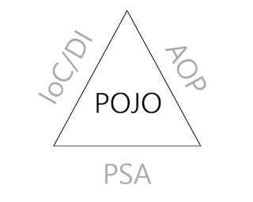
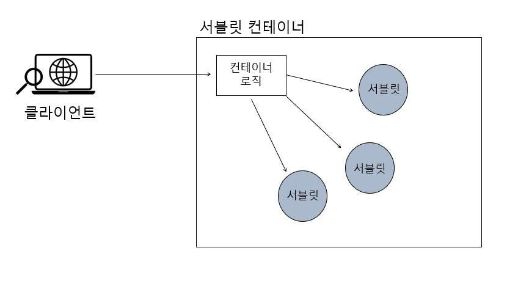
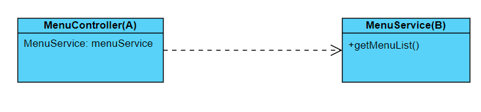
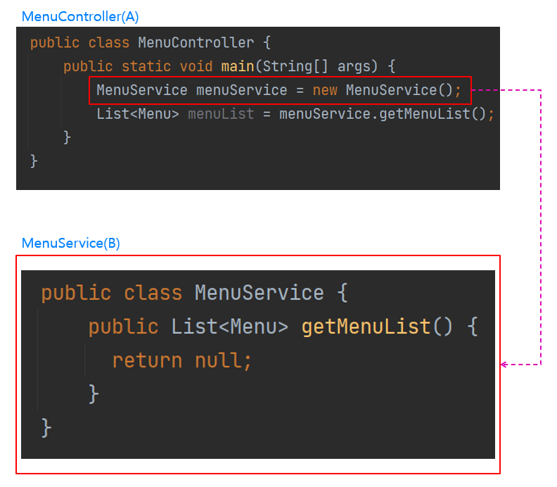
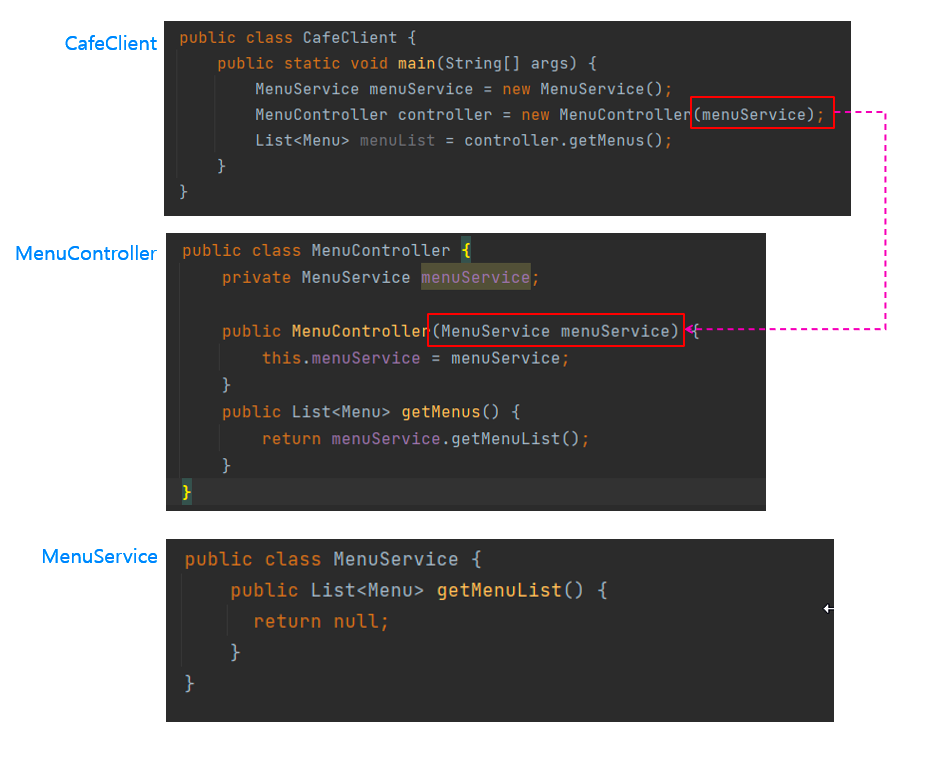
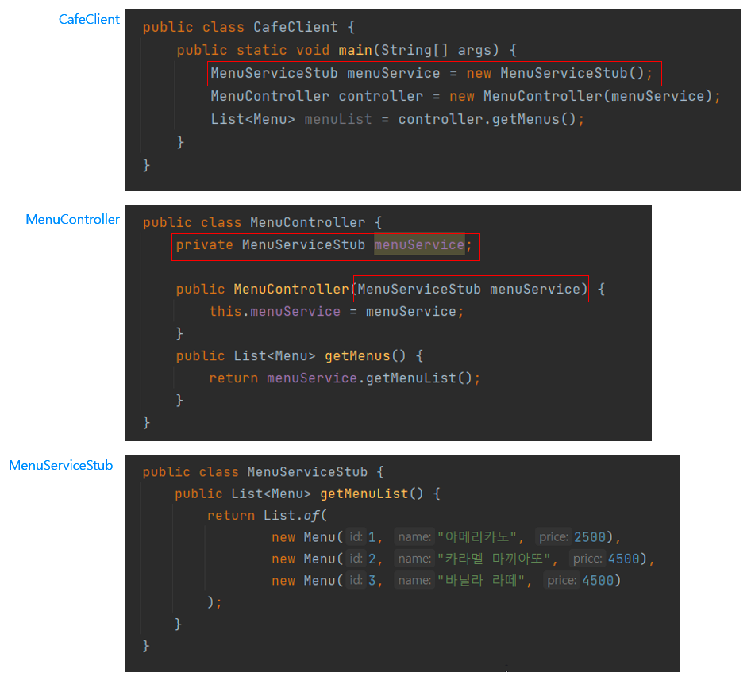
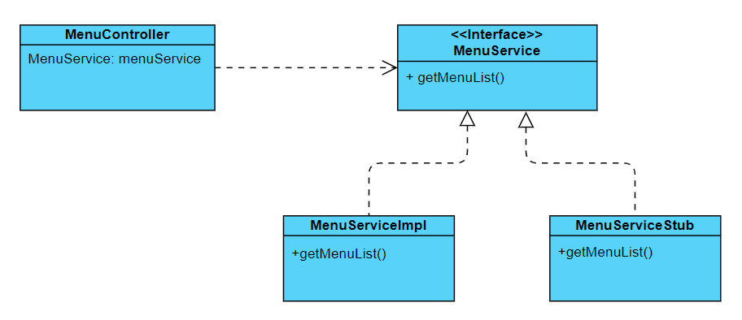
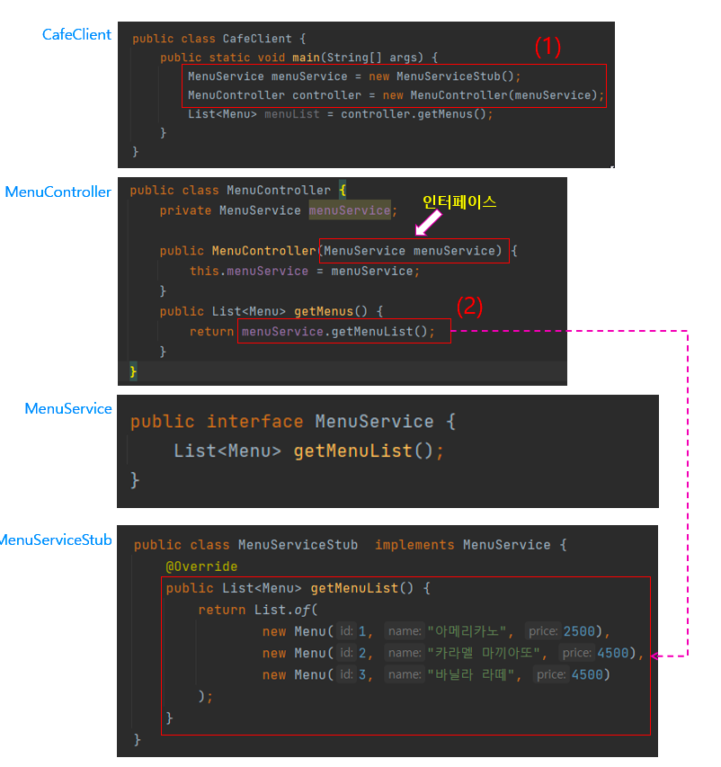
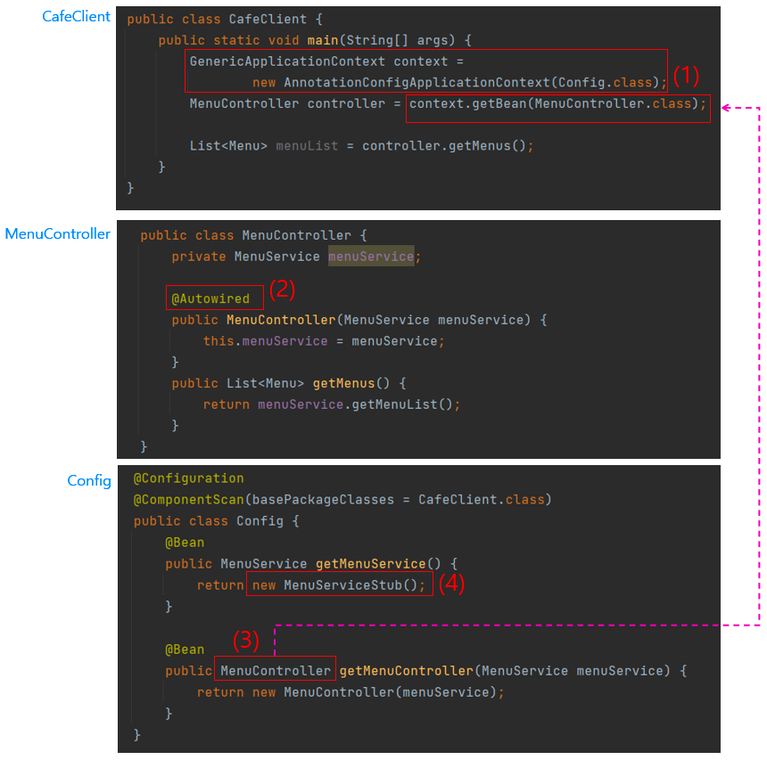
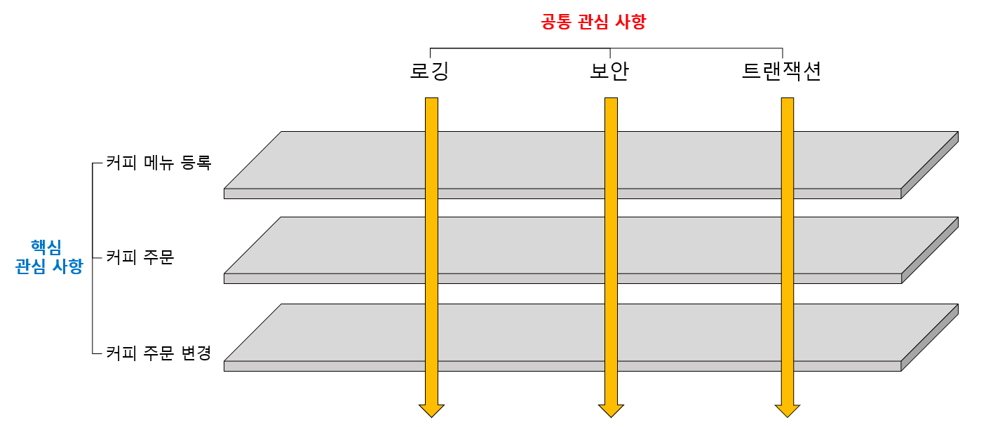

# POJO(Plain Old Java Object)



이 그림은 POJO라는 것을 `IoC/DI, AOP, PSA`를 통해서 달성할 수 있다는 것을 의미한다.
이 때 [POJO][POJO]는 오래된 방식의 간단한 자바 오브젝트라는 말로서, Java EE 등의 중량 프레임워크를 사용하게 되면서 해당 프레임워크에 종속된 "무거운" 객체를 만들게 된 것에 반발해서 사용하게 된 용어다. 

[POJO]: https://ko.wikipedia.org/wiki/Plain_Old_Java_Object

POJO 프로그래밍이란 POJO를 이용해서 프로그래밍 코드를 작성하는 것을 의미한다. 그런데 단순히 순수 자바 객체만을 사용해서 코드를 작성한다고 해서 POJO 프로그래밍이라고 볼 수는 없고, `두 가지 규칙`을 만족해야 한다.

### 1. Java나 Java의 스펙에 정의된 것 이외에는 다른 기술이나 규약에 얽매이지 않아야 한다.
```
public class MessageForm extends ActionForm{ // (1)
	
	String message;

	public String getMessage() {
		return message;
	}

	public void setMessage(String message) {
		this.message = message;
	}
	
}

public class MessageAction extends Action{ // (2)
	
	public ActionForward execute(ActionMapping mapping, ActionForm form,
		HttpServletRequest request, HttpServletResponse response)
        throws Exception {
		
		MessageForm messageForm = (MessageForm) form;
		messageForm .setMessage("Hello World");
		
		return mapping.findForward("success");
	}
	
}
```
ActionForm과 Action은 Struts라는 웹 프레임워크에서 지원하는 클래스다. (1), (2)에서 Struts를 사용하기 위해 ActionForm과 Action을 상속받고 있다.

이렇게 특정 기술을 상속해서 코드를 작성하게 되면, 나중에 애플리케이션의 요구사항이 변경되서 다른 기술로 변경하려면 Struts의 클래스를 명시적으로 사용했던 부분을 일일히 제거하거나 수정해야 한다.
그리고 Java는 다중 상속을 지원하지 않기 때문에 한 번 상속을 하게 되면 상위 클래스를 상속받아서 하위 클래스를 확장하는 객체지향 설계 기법을 적용하기 어려워지게 된다. 

### 2. 특정 환경에 종속되지 않아야 한다.  
Servlet 기반의 웹 애플리케이션을 실행시키는 서블릿 컨테이너(Servlet Container)인 아파치 톰캣(Apache Tomcat)을 예시로 들어보자.
순수 Java로 작성한 애플리케이션 코드 내에서 Tomcat이 지원하는 API를 직접 가져다 쓴다고 가정해보자. 그런데 요구사항이 변경되어서 Tomcat 말고 제티(Zetty)라는 다른 Servlet Container를 사용하게 된다면 어떻게 될까?
애플리케이션 코드에서 사용하고 있는 Tomcat API 코드를 모두 걷어내고 Zetty로 수정하던가 아니면 애플리케이션을 전부 고쳐야하는 상황에 직면하게 될수도 있다.

<br>

### 앞서 말했던 내용을 종합해보면, `POJO 프로그래밍이 필요한 이유`는 5가지가 있다.
1. 특정 환경이나 기술에 종속적이지 않으면 재사용 가능하고, 확장 가능한 유연한 코드를 작성할 수 있다.
2. 저수준 레벨의 기술과 환경에 종속적인 코드를 애플리케이션 코드에서 제거 함으로써 코드가 깔끔해진다.
3. 코드가 깔끔해지기 때문에 디버깅하기도 상대적으로 쉽다.
4. 특정 기술이나 환경에 종속적이지 않기 때문에 테스트 역시 단순해진다.
5. **객체 지향적인 설계를 제한없이 적용할 수 있다.**

Spring은 `POJO 프로그래밍을 지향하는 Framework`다. 그리고 다른 환경이나 기술에 종속되지 않게 하기 위한 POJO 프로그래밍 코드를 작성하기 위해서 Spring에서는 세 가지 기술을 지원하고 있다.
그 기술들에 대해 알아보자.

<br>

## IoC(Inversion of Control) / DI(Dependency Injection)
`애플리케이션 흐름의 주도권이 바뀐 것`을 IoC라 한다. IoC를 이해하기 위해서 기존에 우리가 알고 있던 애플리케이션의 흐름과 그 반대 흐름의 의미를 샘플 코드 및 그림을 통해 알아보자.

### Java 콘솔 애플리케이션의 일반적인 제어권
```
public class Example {
    public static void main(String[] args) {
        System.out.println("Hello IoC!");
    }
}
```
일반적으로 위와 같은 Java 콘솔 애플리케이션을 실행하려면 `main() 메서드`가 필요하다. 그래야지만 main() 메서드 안에서 다른 객체의 메서드를 호출한다던가 하는 프로세스가 진행되기 때문이다.
위 코드에서는 main() 메서드가 호출되고 난 다음에 System 클래스를 통해서 static 멤버 변수인 out의 println()을 호출한다. 이후 `main() 메서드가 종료되면서 애플리케이션의 실행도 종료`된다. 이런 식으로 개발자가 작성한 코드를 순차적으로 실행하는 것이 애플리케이션의 일반적인 흐름이다.

### Java 웹 애플리케이션에서 IoC가 적용되는 예
이번에는 웹 상에서 돌아가는 Java 웹 애플리케이션을 보자.



위 그림은 Servlet 기반의 애플리케이션을 웹에서 실행하기 위한 서블릿 컨테이너(Servlet Container)의 모습이다.

웹에서 동작하는 애플리케이션의 경우 클라이언트가 외부에서 접속해서 사용하는 서비스이기 때문에 main() 메서드가 종료되지 않아야 한다. 그런데 서블릿 컨테이너에서는 서블릿 사양(Specification)에 맞게 작성된 서블릿 클래스만 존재하지 별도의 main() 메서드는 존재하지 않는다. main() 메서드가 없는데 어떻게 애플리케이션이 실행되는 걸까?
서블릿 컨테이너의 경우, `클라이언트의 요청이 들어올 때마다 서블릿 컨테이너 내의 컨테이너 로직(service() 메서드)이 서블릿을 직접 실행시켜주기 때문에 main() 메서드가 필요없다.`

> main() 메서드 처럼 애플리케이션이 실행되는 지점을 엔트리 포인트(Entry point)라고 부른다.

이 경우 서블릿 컨테이너가 Servlet을 제어하고 있기 때문에 애플리케이션의 주도권은 서블릿 컨테이너에 있다. 즉, 서블릿과 애플리케이션 간에 IoC(제어의 역전)의 개념이 적용되어 있는 것이다.

그렇다면 Spring에는 IoC의 개념이 어떻게 적용되어 있을까?

답은 바로 `DI(Dependency Injection)`다.

<br>

### What is DI?
IoC는 서버 컨테이너 기술, 객체 지향 설계, 디자인 패턴에 적용되는 일반적인 개념이고, DI는 IoC 개념을 구체화한 것이라고 볼 수 있다. DI는 말 그대로 `의존성 주입`이라는 의미를 가진다.
객체지향 프로그래밍에서 의존성은 대개 객체 간 의존성을 의미한다. 

A, B라는 클래스를 만들고 A 클래스에서 B 클래스의 기능을 사용하기 위해 B 클래스에 구현되어 있는 메서드를 호출해보자.



A 클래스가 B 클래스의 기능을 사용할 때, `A 클래스는 B 클래스에 의존한다`고 표현한다.

이번에는 코드를 통해 의존성 주입에 대해 더 알아보자.
- 클래스 간의 의존관계 성립



카페에서 커피를 주문하는 Java 콘솔 애플리케이션을 개발한다고 상상해 보자.
위 그림에서 `MenuController 클래스`는 클라이언트의 요청을 받는 엔드 포인트(End point) 역할을 하고, `MenuService 클래스`는 MenuController 클래스가 전달 받은 클라이언트의 요청을 처리하는 역할을 한다.

> 클라이언트 측면에서 서버의 엔드 포인트(End point)는 클라이언트가 서버의 자원(Resource)을 이용하기 위한 끝지점을 의미한다.

MenuController 클래스는 메뉴 목록을 조회하기 위해 MenuService 클래스의 기능을 이용한다. 즉, `new 키워드`를 사용하여 MenuService 클래스의 객체를 생성한 후, 이 객체로 getMenuList() 메서드를 호출한다.

이처럼 사용하고자 하는 클래스의 객체를 생성하여 참조하게 되면 클래스간 의존 관계가 성립한다.

- 의존성 주입

클래스간 의존 관계는 성립 되었지만, 의존성 주입은 아직 이루어지지 않았다. 이번에는 의존성을 주입해보자.



이번에는 MenuController 생성자로 MenuService의 객체를 전달받고 있다. 이처럼 `생성자를 통해서 어떤 클래스의 객체를 전달받는 것`을 `의존성 주입`이라 한다.
즉, 생성자의 파라미터로 객체를 전달하는 것을 `외부에서 객체를 주입한다`고 표현한다. 여기서 `CafeClient 클래스`가 MenuController의 생성자 파라미터로 menuService를 전달하고 있기 때문에 객체를 주입해주는 외부가 된다.

<br> 

### Why do we need DI?
의존성 주입을 할 때, 항상 염두에 두어야 하는 부분이 있다. 그것은 현재 클래스 내부에서 외부 클래스 객체를 생성하기 위한 `new 키워드를 쓸지 말지 여부를 결정하는 것`이다.
일반적으로 Java에서 new 키워드를 사용해서 객체를 생성하는데, `애플리케이션 코드 내부에서 직접적으로 new 키워드를 사용할 경우 객체지향 설계의 관점에서 문제가 발생`할 수 있다.

어떤 문제가 발생할 수 있는지 애플리케이션 개발 과정에서 실제로 발생할 수 있는 대화 사례를 통해 알아보자.
```
FE: 저희 팀에서 메뉴 목록 화면에 표시할 데이터를 API로 통신하고 싶은데 혹시 메뉴 목록 데이터 조회 API를 사용할 수 있을까요?
BE: 아직 API 틀만 구성한 상태인데 필요하시면 스텁(Stub)으로 제공해도 될까요?
FE: 네, API 통신 잘 되는지랑 화면 구성이 괜찮은지 정도만 확인 할꺼라서 Stub으로 해주셔도 될 것 같아요.
BE: 알겠습니다. 조금만 기다려 주세요.
```

> 스텁(Stub)는 메서드가 호출되면 미리 준비한 고정된 데이터를 응답하는 것이다. 고정된 데이터는 몇 번을 호출하여도 같은 데이터를 리턴하기 때문에 멱등성을 가진다고 한다.


이제 BE는 메뉴 목록 조회 API를 위한 Stub를 준비하기 위해서 `MenuServiceStub 클래스`를 추가로 작성해서 다음과 같이 코드를 수정했다. 



그런데 MenuServiceStub 클래스를 사용하려면 MenuService 클래스를 의존하고 있는 CafeClient와 MenuController에서 MenuService를 MenuServiceStub으로 변경해야 한다.
이처럼 이미 작성된 코드를 직접 수정하는 방법은 버그가 발생할 가능성이 높으므로 바람직하지 않다.

즉, new 키워드를 사용하여 객체를 생성한다면 참조할 클래스가 바뀌게 되는 경우마다 이 클래스를 사용하는 모든 클래스를 일일히 수정해줘야 한다.
이처럼 new 키워드를 사용해서 의존 객체를 생성할 때, 클래스 간에 `강하게 결합(Tight Coupling)`되어 있다고 한다.
결론적으로 의존성 주입을 할 때는 강하게 결합하는 것보다 `느슨하게 결합(Loose Coupling)`하는 편이 좋다.

<br>

### Loose Coupling
Java에서 클래스 간의 관계를 느슨하게 만드는 대표적인 방법은 `인터페이스(Interface)`를 사용하는 것이다.



위 클래스 다이어그램에서 MenuController 클래스는 MenuService 인터페이스에 의존하고 있다. MenuController 입장에서는 그저 메뉴 목록 데이터를 조회하기만 하면 되기 때문에 MenuService 인터페이스의 구현체가 MenuServiceImpl 인지 MenuServiceStub 인지는 중요하지 않다.
이처럼 어떤 클래스가 인터페이스와 같이 일반화된 구성 요소에 의존하고 있을 때, 클래스들 간에 `느슨하게 결합(Loose Coupling)`되어 있다고 한다.

이번에는 위 다이어그램을 코드로 표현해보자.



MenuController 클래스는 생성자로 MenuService 인터페이스를 주입받았기 때문에 MenuService 인터페이스의 구현 클래스이면 어떤 클래스든 주입받을 수 있다.

(1)에서 new 키워드로 MenuServiceStub 클래스의 객체를 생성해서 MenuService 인터페이스에 할당한다. 이처럼 인터페이스 타입의 변수에 그 인터페이스의 구현 객체를 할당할 수 있는데 이를 `업캐스팅(Upcasting)`이라 한다.
이제 업캐스팅을 통한 의존성 주입으로 인해 MenuController와 MenuService는 `느슨한 결합 관계`를 가진다.

클래스들 간의 관계를 느슨하게 만들기 위해서는 `new 키워드`를 사용하지 않아야 하는데, (1)에서는 MenuService 클래스와 MenuController 클래스의 객체를 만들기 위해서 여전히 new 키워드를 사용했다.

이 new 키워드를 제거하기 위해서 어떻게 해야할까? 이 부분은 `Spring`에서 대신 해준다.



(1)에 해당하는 코드는 모두 Spring에서 지원하는 API 코드다. 

> Spring Framework에 해당하는 코드가 애플리케이션 코드에 직접적으로 나왔으므로 POJO 프로그래밍의 규칙 중 1번인 '다른 기술이나 규약에 얽매이지 않아야 한다'를 위반한다. 즉, 좋은 개발 방식이 아니다.
> 위 코드는 Spring을 이용한 DI의 예시를 보여주기 위한 목적으로 쓰였으며, 실제 Spring 기반의 웹 애플리케이션에는 (1)과 같은 코드는 나오지 않는다.

아무튼 (1)의 Spring 코드 덕분에 new 키워드를 없애는데 성공했다. 제일 하단의 Config 클래스를 살펴보면, @Configuration, @ComponentScan, @Bean과 같은 애노테이션(Annotation)들이 보인다. 지금은 각 애노테이션의 의미에 대한 설명은 잠시 접어두고, `Config 클래스의 역할`에 집중하자.
Config 클래스에서 (3)과 같이 MenuController 객체 생성을 정의해두면 (1)을 이용해서 이 객체를 애플리케이션 코드에서 사용하게 된다.
즉, `Config 클래스에서 정의해둔 MenuController 객체를 Spring의 도움을 받아서 CafeClient 클래스에 제공하고 있는 것이다.`

하지만 여기서 한가지 걸리는 점이 있다. new 키워드를 없애기 위해서 Config 클래스를 만들었으나, Config 클래스 안에서 new 키워드로 객체를 생성했으므로 결국 마찬가지인게 아닌가 하는 점이다.
그렇게 볼 수도 있지만, Config 클래스는 단순한 클래스가 아니고 온전하게 Spring Framework의 영역에 해당하는 것이고, `실제 애플리케이션의 핵심 로직에는 관여하지 않고 있다.`

이처럼 Spring 기반의 애플리케이션에서는 Spring이 의존 객체들을 주입해주기 때문에 코드를 유연하게 구성할 수 있다.

앞에서 했던 FE와 BE의 대화를 다시 보자. BE에서 메뉴 목록 조회 기능을 완성했다면, 이제 Stub 데이터 대신에 실제 데이터를 데이터베이스에서 제공해주면 될텐데 이럴 경우 애플리케이션 코드에서 변경할 내용들이 있을까?

(4)와 같이 Spring Framework 영역에 있는 MenuServiceStub 클래스를 MenuServiceImpl 클래스로 `단 한번만` 변경해주면 된다.

<br>

## AOP(Aspect Oriented Programming)
AOP는 `관심 지향 프로그래밍` 정도로 해석할 수 있다. 그렇다면 이 관심(Aspect)을 지향하는 프로그래밍에서 관심은 무엇을 의미할까?


### 공통 관심 사항과 핵심 관심 사항
AOP에의 Aspect는 `애플리케이션에 필요한 기능 중 공통적으로 적용되는 공통 기능에 대한 관심(Cross-cutting concern)`과 관련이 있다.

그리고 비즈니스 로직, 즉 애플리케이션의 주목적을 달성하기 위한 핵심 로직에 대한 관심사를 `핵심 관심 사항(Core concern)`이라고 한다.

커피 주문을 위한 애플리케이션을 예로 들어보자. 카페의 주인이 고객에게 제공하는 커피 메뉴를 구성하기 위해 커피 종류를 등록하는 것과 고객이 커피를 주문하는 기능은 애플리케이션의 `핵심 관심 사항`이 된다.
그리고 커피 주문 애플리케이션에 아무나 접속하지 못하도록 제한하는 애플리케이션 보안에 대한 부분은 애플리케이션 전반에 공통적으로 적용되는 기능이기 때문에 `공통 관심 사항`이 된다.



위 그림을 보면 로깅, 보안, 트랜잭션과 같은 공통 관심 사항 기능들의 화살표가 애플리케이션의 핵심 관심 사항을 관통하고 있다. 즉, 공통 관심 사항의 기능들이 애플리케이션의 핵심 로직에 전반적으로 두루 사용된다는 의미다.
그리고 공통 관심 사항이 핵심 관심 사항에 멀찌감치 떨어져 있음을 볼 수 있는데, 이는 공통 관심 사항이 핵심 관심 사항에서 분리되어 있다는 것을 의미한다.

결국, AOP는 `애플리케이션의 핵심 업무 로직에서 벗어나 공통 기능 로직들을 분리하는 것`이라고 생각할 수 있다.

### AOP가 필요한 이유
그렇다면 애플리케이션의 핵심 로직에서 공통 기능을 분리하는 이유가 뭘까?
- 코드의 간결성 유지
- 코드의 재사용
- 객체 지향 설계 원칙에 맞는 코드 구현

상식적으로 애플리케이션의 핵심 로직에 공통적인 기능의 코드들이 여기 저기 보인다면 코드의 구성이 복잡해질 것이고, 그에 따라 버그가 발생할 가능성이 높아지고 유지 보수가 어려워지게 된다.
그리고 만약 이런 공통 기능들에 수정이 필요하게 된다면 애플리케이션 전반에 적용되어 있는 공통 기능에 해당하는 코드를 일일히 수정해야 되는 문제가 발생할 수 있다.

AOP가 적용되지 않은 코드와 적용된 코드를 비교해보자.

```
public class Example {
    private Connection connection;

    public void registerMember(Member member, Point point) throws SQLException {
        connection.setAutoCommit(false); // (1)
        try {
            saveMember(member); // (2)
            savePoint(point);   // (2)
            
            connection.commit(); // (3)
        } catch (SQLException e) {
            connection.rollback(); // (4)
        }
    }

    private void saveMember(Member member) throws SQLException {
        PreparedStatement psMember =
                connection.prepareStatement("INSERT INTO member (email, password) VALUES (?, ?)");
        psMember.setString(1, member.getEmail());
        psMember.setString(2, member.getPassword());
        psMember.executeUpdate();
    }

    private void savePoint(Point point) throws SQLException {
        PreparedStatement psPoint =
                connection.prepareStatement("INSERT INTO point (email, point) VALUES (?, ?)");
        psPoint.setString(1, point.getEmail());
        psPoint.setInt(2, point.getPoint());
        psPoint.executeUpdate();
    }
}
```
위 코드는 `트랜잭션 기능에 대해 AOP가 적용되지 않은 예시`다. Java의 JDBC API를 사용했는데, API 기능을 이해하려 하지 말고 코드의 흐름에만 집중하자. 

> 트랜잭션(transaction)이란 '데이터를 처리하는 하나의 작업 단위'를 의미한다. 예를 들어 데이터베이스에 A 데이터와 B 데이터를 각각 insert하는 작업을 하나의 트랜잭션으로 묶는다면, A 데이터와 B 데이터는 모두 데이터베이스에 저장되던가 아니면 둘 중 하나라도 오류로 인해 저장되지 않는다면, A, B 데이터는 모두 데이터베이스에 반영되지 않아야 한다.(All or Nothing)
> 
> 이러한 처리를 위해 트랜잭션에는 커밋(commit)과 롤백(rollback)이라는 기능이 있다.
>
> 커밋은 트랜잭션의 모든 작업들이 성공적으로 수행되었을 때 수행한 작업들을 데이터베이스에 반영하는 것이고, 반대로 롤백은 작업이 하나라도 실패한다면 작업 수행 이전의 상태로 되돌리는 것을 말한다.  

위 코드의 `registerMember 메서드`는 커피 주문 애플리케이션을 사용할 회원 정보를 등록하는 기능을 한다. 메서드 내에서 비즈니스 로직을 수행하는 코드는 회원 정보를 저장하는 (2)의 `saveMember()`와 회원의 포인트 정보를 저장하는 `savePoint()`다.
이외에 `(1)의 connection.setAutoCommit(false)`와 `(3) connection.commit()`, `(4) connection.rollback()`은 saveMember()와 savePoint() 작업을 하나의 트랜잭션으로 묶어서 처리하기 위한 기능들이다.
문제는 이러한 트랜잭션 처리 코드들이 애플리케이션의 다른 기능에도 반복적으로 나타난다는 것이다. 이럴 때 `AOP를 통해서 중복된 코드를 공통화하여 재사용할 수 있도록 만들어야 한다.`

그런데 Spring에서는 이미 이러한 트랜잭션 처리 기능을 AOP를 통해서 공통화해준다.

```
@Component
@Transactional // (1)
public class Example {
    private Connection connection;

    public void registerMember(Member member, Point point) throws SQLException {
        saveMember(member);
        savePoint(point);
    }

    private void saveMember(Member member) throws SQLException {
        // Spring JDBC를 이용한 회원 정보 저장
    }

    private void savePoint(Point point) throws SQLException {
        // Spring JDBC를 이용한 포인트 정보 저장
    }
}
```
위 코드는 Spring의 AOP 기능을 이용하여 registerMember()에 트랜잭션을 적용한 예시다. 이를 통해 순수하게 비즈니스 로직만을 처리하기 위한 saveMember(member)와 savePoint(point)만 남게 되었다.

그렇다면 트랜잭션 처리는 어떻게 한 것일까?  
(1)의 @Transactional 애노테이션 하나만 붙이면 Spring 내부에서 이 애노테이션을 활용하여 AOP 기능을 통해 트랜잭션을 적용한다.

결론적으로, 이처럼 AOP를 활용하면 `애플리케이션 전반에 걸쳐 적용되는 공통 기능 등을 비즈니스 로직에서 깔끔하게 분리하여 재사용 가능한 모듈로 사용`할 수 있다. 

<br>

## PSA(Portable Service Abstraction)
