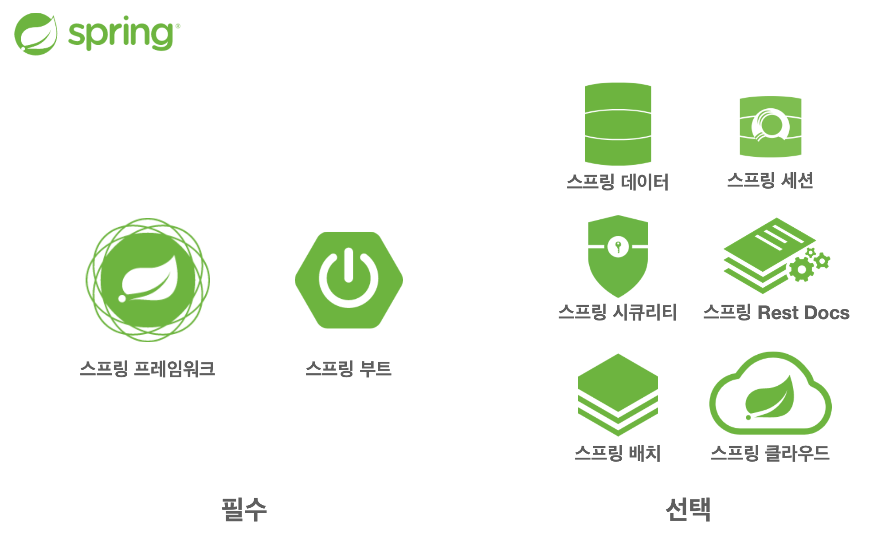
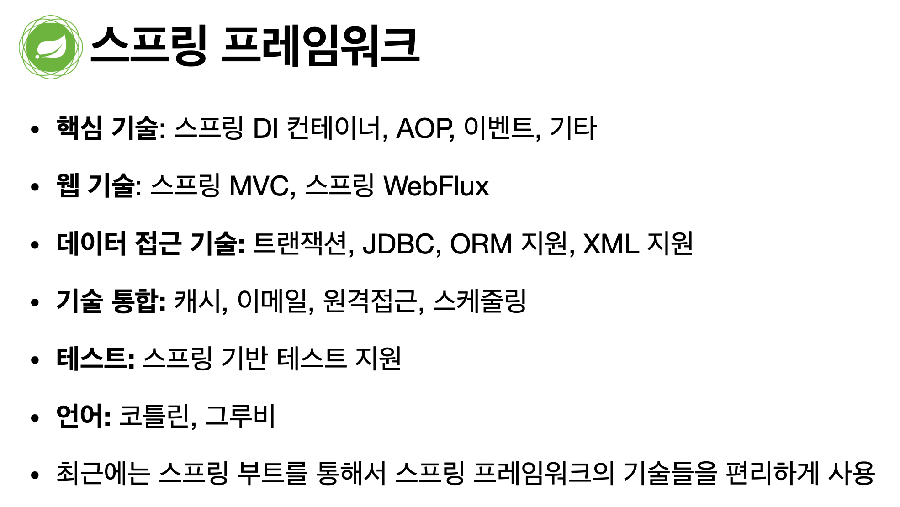
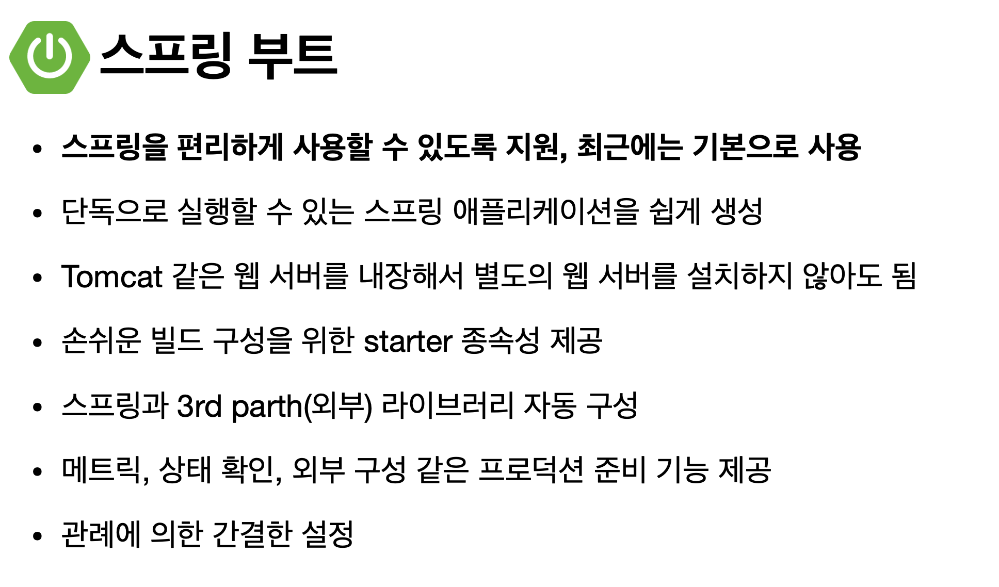
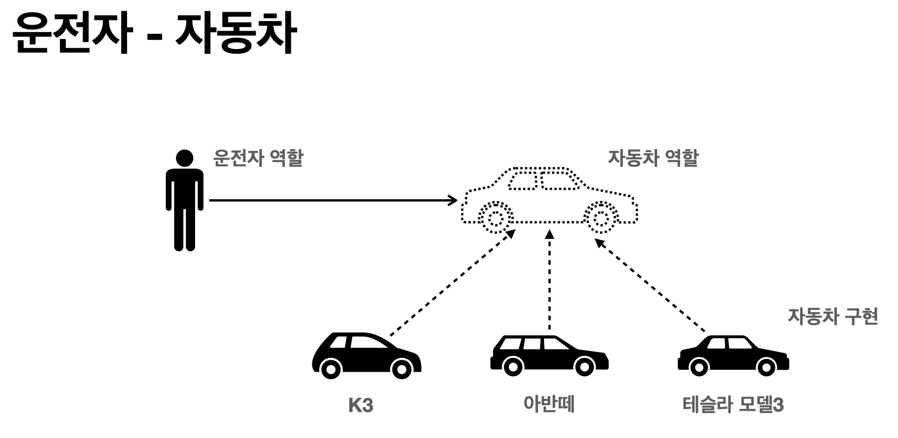
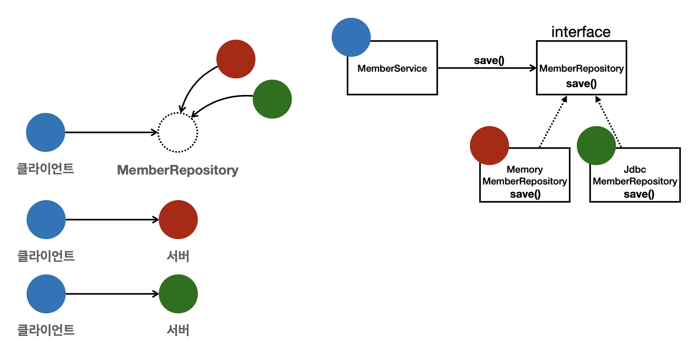
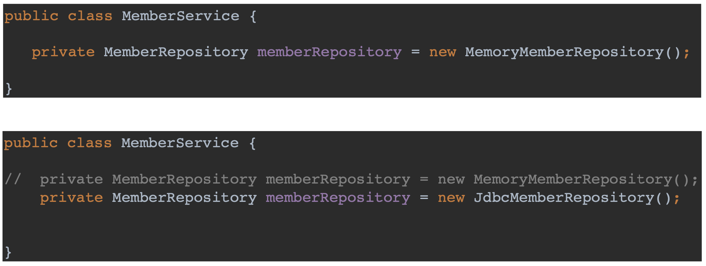

# 객체지향 설계와 스프링
___

`스프링`이라는 단어는 문맥에 따라 다르게 사용된다.
- 스프링 DI 컨테이너 기술
- 스프링 프레임워크
- 스프링 부트, 스프링 프레임워크 등을 모두 포함한 생태계

## 스프링은 왜 만들었을까?
스프링은 객체 지향 언어(Java)가 가진 강력한 특징을 살려내는 프레임워크다. 즉, 스프링은 `좋은 객체 지향 애플리케이션을 개발`할 수 있게 도와주는 프레임워크다.

 

## 좋은 객체 지향 프로그래밍이란?
### 객체 지향 프로그래밍
- 객체 지향 프로그래밍은 컴퓨터 프로그램을 명령어의 목록으로 보는 시각에서 벗어나 여러 개의 독립된 단위, 즉 `객체들의 모임`으로 파악하고자 하는 것이다. 각각의 객체는 메세지를 주고받고, 데이터를 처리할 수 있다.(협력)
- 객체 지향 프로그래밍은 프로그램을 `유연하고 변경에 용이하게` 만들기 때문에 대규모 소프트웨어 개발에 사용된다.(ex. 레고블럭)

 

### 객체 지향의 꽃, 다형성(Polymorphism)
**역할과 구현**으로 세상을 구분해보자. 여기서 역할은 인터페이스, 구현은 그 인터페이스를 구현한 객체, 클래스다.

운전자는 자동차(인터페이스)의 종류가 바뀌어도 운전할 수 있다. 왜냐하면 자동차란 역할의 구현체만 바뀌었기 때문이다. 즉, 자동차가 바뀌어도 운전자에게 영향을 주지 않는다.

이 운전자를 클라이언트라고 하자. 클라이언트는 자동차의 내부 구조를 몰라도 된다. 그리고 자동차의 구현체가 바뀌어도 클라이언트에게 영향을 주지 않는다. 즉, `클라이언트에 영향을 주지 않고 무한정 새로운 기능을 제공할 수 있다`.

정리하자면, 역할과 구현으로 구분하면 세상이 단순해지고, 유연해지며, 변경도 편리해진다.
- 클라이언트는 `대상의 역할(인터페이스)`만 알면 된다.
- 클라이언트는 구현 대상의 `내부 구조를 몰라도` 된다.
- 클라이언트는 구현 대상의 `내부 구조가 변경되어도` 영향을 받지 않는다.
- 클라이언트는 구현 대상 `자체를 변경해도` 영향을 받지 않는다.

프로그래밍 언어(Java)에서도 이러한 개념을 차용했다.
- 객체를 설계할 때 역할과 구현을 명확하게 분리한다.
- 객체 설계 시 `역할(인터페이스)를 먼저 부여`하고, 그 역할을 수행하는 구현 객체를 만든다.

`객체의 협력`이라는 관계부터 생각하자. 수 많은 객체 클라이언트와 객체 서버는 서로 협력 관계를 가진다.

 

Java 언어에서의 다형성을 예시로 들어보자. `오버라이딩(Overriding)`이 기억나는가?

위 그림에서 MemberService가 MemberRepository의 save()를 호출하면, 오버라이딩된 MemoryMemberRepository 혹은 JdbcMemberRepository의 save()가 실행된다. 즉, 다형성으로 인터페이스를 구현한 객체를 실행 시점에 유연하게 변경할 수 있다. (선택가능)

 

**"다형성의 본질"**
- 인터페이스를 구현한 객체 인스턴스를 실행 시점에 유연하게 변경할 수 있다. 
- 다형성의 본질을 이해하려면 **협력**이라는 객체 사이의 관계에서부터 시작해야한다.
- `클라이언트를 변경하지 않고, 서버의 구현 기능을 유연하게 변경할 수 있다.`

### 스프링과 객체 지향
스프링에서 이야기하는 `제어의 역전(IoC)`, `의존관계 주입(DI)`은 다형성을 활용해서 역할과 구현을 편리하게 다룰 수 있도록 지원한다. 또한 스프링을 사용하면 마치 레고 블럭을 조립하듯이 구현을 편리하게 변경할 수 있다.

 

## 좋은 객체 지향 설계의 5가지 원칙(SOLID)
클린코드의 저자로 유명한 로버트 마틴이 좋은 객체 지향 설계의 5원칙을 정리했는데, 앞글자를 따서 **SOLID** 라고 부른다.

SRP: 단일 책임 원칙  
OCP: 개방-폐쇄 원칙  
LSP: 리스코프 치환 원칙  
ISP: 인터페이스 분리 원칙  
DIP: 의존관계 역전 원칙

이 5가지 원칙을 관통하는 것이 위에서 강조한 `다형성`이다.

### SRP(Single Responsibility Principle): 단일 책임 원칙
`하나의 클래스는 하나의 책임만 가져야 한다.` 그런데 문맥과 상황에 따라 '하나의 책임' 이라는 것은 모호할 수가 있다. 중요한 기준은 `변경 시 파급력`이다. 변경이 있을 때 파급 효과가 적으면 SRP를 잘 따른 것이다.

 

### OCP(Open/Closed Principle) : 개방 / 폐쇄 원칙
`소프트웨어 요소는 확장에는 열려 있으나, 변경에는 닫혀 있어야 한다.`  

이전에 배웠던 역할과 구현을 분리한 실생활 예시를 떠올려 보자.

자동차의 역할(기능)이 동일하다면, 구현된 자동차가 K3이든 아반떼든 운전자(클라이언트)는 영향을 받지 않는다. 즉, `인터페이스를 구현한 새로운 클래스를 하나 만들어서 새로운 기능을 구현한다.`

 

#### OCP의 문제점

MemberService 클라이언트가 구현 객체를 직접 선택했다. 이 때 구현 객체를 변경하려면 클라이언트 코드를 변경해야 한다. 분명 다형성을 사용했지만 OCP 원칙을 지킬 수 없다.

이 문제를 어떻게 해결해야 할까?

객체를 생성하고 연관관계를 맺어주는 별도의 조립, 설정자가 필요하다. 이 별도의 무언가를 `스프링 컨테이너`가 해결해준다.

 

### LSP(Liskov Substitution Principle): 리스코프 치환 원칙

`프로그램의 객체는 프로그램의 정확성을 깨뜨리지 않으면서 하위 타입의 인스턴스로 바꿀 수 있어야 한다.` 즉, 다형성에서 하위 클래스는 인터페이스 규약을 다 지켜야 한다는 것이다. 인터페이스의 구현체를 믿고 사용하려면 LSP를 지켜야 한다.

여기에 자동차 인터페이스가 있다. 구현체인 A 자동차는 `전진 기능을 제공하는 엑셀 메서드`를 구현해야한다.  
엑셀 메서드를 호출하면 앞으로 가야하는데, 사실 뒤로 가는 차도 만들 수 있다. 그렇다 해도 컴파일 오류는 나지 않는다.
하지만 LSP는 단순히 컴파일 단계를 얘기하는 것이 아니라, 인터페이스의 규약인 `엑셀은 앞으로 가야한다`를 지켜야한다. 느리더라도 전진해야 한다. 즉, 메서드의 존재 의미에 맞게 기능적으로 보장을 해줘야 한다.

 

### ISP((Interface Segregation Principle): 인터페이스 분리 원칙

`특정 클라이언트를 위한 인터페이스 여러 개가 범용 인터페이스 하나보다 낫다.`

자동차 인터페이스 하나만 있다면 너무 범위가 크므로, 운전 인터페이스와 정비 인터페이스로 분리하자. 또한 사용자 클라이언트를 운전자 클라이언트, 정비사 클라이언트로 분리하자. 그렇다면 정비 인터페이스 자체가 변해도 운전자 클라이언트 영향을 미치지 않는다.

이처럼 인터페이스를 적당한 규모로 쪼갬으로써 인터페이스가 명확해지고 대체하기에 편해진다. 

### DIP(Dependency Inversion Principle): 의존관계 역전 원칙

프로그래머는 `추상화에 의존해야지, 구체화에 의존하면 안된다.` 의존성 주입은 이 원칙을 따르는 방법 중 하나이다. 즉, 클라이언트 코드가 구현 클래스에 의존하지 말고, `인터페이스에 의존하라는 뜻`이다.
앞에서 이야기한 `역할에 의존`하라는 것과 같은 얘기다.

객체 세상도 클라이언트가 인터페이스에 의존해야 유연하게 구현체를 변경할 수 있다. 구현체에 의존하게 되면 변경이 어려워진다.

앞서 OCP에서 설명한 MemberService는 인터페이스에 의존하지만 동시에 구현 클래스에도 의존한다. 즉, `DIP를 위반`하고 있다.
MemberService가 new 키워드를 사용하여 구현 클래스를 직접 선택하고 있기 때문이다. 

### SOLID 정리
객체 지향의 핵심은 다형성이다. 하지만 다형성만으로는 쉽게 부품을 갈아 끼우듯 개발할 수 없다. 즉, 다형성만으로는 구현 객체를 변경할 때 클라이언트 코드도 함께 변경해야 한다.(OCP, DIP 위반)

 

## 객체 지향 설계와 스프링
### 스프링 이야기에 왜 객체 지향 원칙이 나올까?
스프링은 다음 기술로 `다형성 + OCP, DIP`를 가능하게 지원해주기 때문이다.
- DI(Dependency Injection): 의존관계, 의존성 주입
- DI 컨테이너 : 객체를 컨테이너 안에 넣어서 이 안에서 의존관계를 연결, 주입해주는 기능을 제공한다.

이를 통해 클라이언트 코드의 변경 없이 기능을 확장할 수 있다. 즉, 부품을 교체하듯 개발할 수 있다.

### 스프링이 없던 시절
어떤 개발자가 좋은 객체 지향 개발을 하려고 OCP, DIP 원칙을 지키면서 개발해보니, 너무 할 일이 많았다. 즉, 배보다 배꼽이 더 컸다. 그래서 프레임워크로 만들어 버렸다.

순수하게 자바로 OCP, DIP 원칙을 지키면서 개발해보면, 결국 스프링 프레임워크를 만들게 된다.(더 정확히는 DI 컨테이너)

DI 개념은 코드를 보아야 이해가 될 것이다.

### 정리
모든 설계에 역할과 구현을 분리하자. 하지만, 인터페이스를 무분별하게 도입하면 추상화라는 비용이 발생한다. 다시 말해, 구현 클래스가 한눈에 보이지 않기 때문에 코드를 한번 더 열어봐야 하는 단점이 생긴다. 그래서 코드가 추상화됨으로써 얻는 장점이 이러한 단점을 넘어설 때 선택해야 한다.

기능을 확장할 가능성이 없다면, 구체 클래스를 직접 사용하고, 향후 꼭 필요할 때 리팩토링해서 인터페이스를 구현하는 것도 좋은 방법이다.

 

___
### `Reference`
[Spring Core Principles(Baisc Edition) by 김영한][link]

[link]: https://www.inflearn.com/course/%EC%8A%A4%ED%94%84%EB%A7%81-%ED%95%B5%EC%8B%AC-%EC%9B%90%EB%A6%AC-%EA%B8%B0%EB%B3%B8%ED%8E%B8

