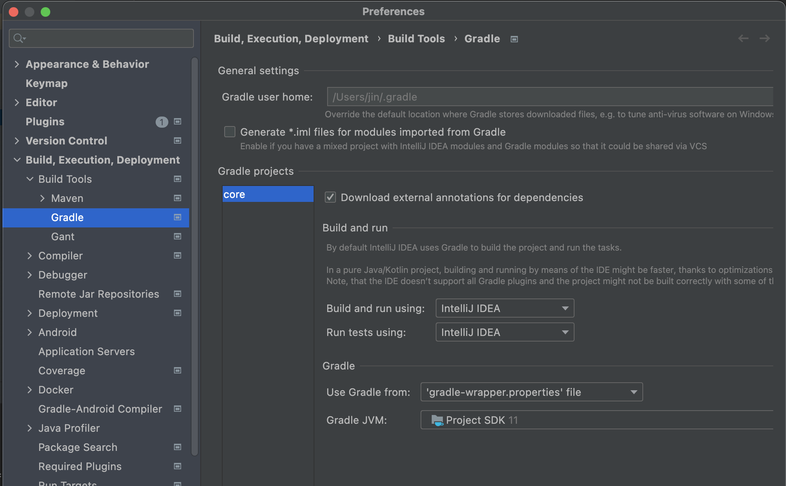

# 스프링 핵심 원리 이해1 - 예제 만들기
___

## 프로젝트 생성

### 사전 준비
- Java 11 설치, IntelliJ 혹은 Eclipse 설치
- 스프링부트 스타터 사이트에서 프로젝트 생성(https://start.spring.io)
> Project : Gradle Project  
> Language : Java   
> Packaging : Jar
> 
> GroupId : hello / ArtifactId : core  
> Dependencies : X  
> 
> 프로젝트 환경설정을 편하게 하려고 스프링 부트를 사용한 것이다. 지금은 스프링의 도움 없이 순수한 Java로만 개발을 진행한다는 점을 꼭 기억하자. 스프링 관련은 한참 뒤에 등장한다.

- 동작 확인 : 기본 메인 클래스 실행(`CoreApplication.main()`)
- IntelliJ Gradle 대신에 Java 직접 실행
최근 IntelliJ 버전은 Gradle을 통해 실행하는 것이 기본 설정이다. 이렇게 하면 실행 속도가 느리다. 다음과 같이 변경하면 IntelliJ가 Java를 바로 실행하므로 실행속도가 더 빠르다.

> Build and run using : IntelliJ IDEA  
> Run tests using : IntelliJ IDEA

## 비즈니스 요구사항과 설계
기획자로부터 아래의 요구사항을 듣게 되었다.  
요구사항은 크게 `회원`, `주문과 할인`으로 구성된다.

### 회원
- 회원을 가입하고 조회할 수 있다.
- 회원은 일반과 VIP 두 가지 등급이 있다.
- 회원 데이터는 자체 DB를 구축할 수 있고, 외부 시스템과 연동할 수 있다.(`미확정`)

### 주문과 할인 정책
- 회원은 상품을 주문할 수 있다.
- 회원 등급에 따라 할인 정책을 적용할 수 있다.
- 할인 정책은 모든 VIP는 1000원을 할인해주는 고정 금액 할인을 적용해달라. (나중에 변경 될 수 있다.)
- 할인 정책은 변경 가능성이 높다. 회사의 기본 할인 정책을 아직 정하지 못했고, 오픈 직전까지 고민을 미루고 싶다. 최악의 경우 할인을 적용하지 않을 수 도 있다. (미확정)

확정되지 않은 부분이 있더라도, 인터페이스를 만들어 구현체를 언제든 갈아끼울 수 있도록 설계하면 된다.

## 회원 도메인 설계

## 회원 도메인 개발

## 회원 도메인 실행과 테스트

## 주문과 할인 도메인 설계

## 주문과 할인 도메인 개발

## 주문과 할인 도메인 실행과 테스트

 

___
### `Reference`
[Spring Core Principles(Baisc Edition) by 김영한][link]

[link]: https://www.inflearn.com/course/%EC%8A%A4%ED%94%84%EB%A7%81-%ED%95%B5%EC%8B%AC-%EC%9B%90%EB%A6%AC-%EA%B8%B0%EB%B3%B8%ED%8E%B8