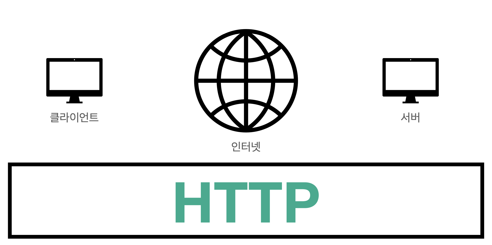
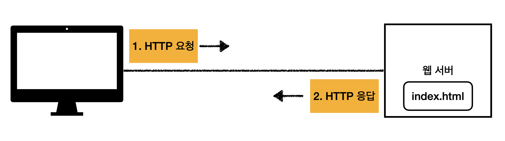

# 웹 애플리케이션 이해
___

## 웹 서버, 웹 애플리케이션 서버

웹이라는 것은 `HTTP`라는 것을 기반으로 통신한다. 예를 들어 웹 브라우저 클라이언트에서 URL을 치면 인터넷을 통해서 서버에 접근하고, 서버에서는 HTML을 만들어서 클라이언트에 내려준다. 그 후 웹 브라우저가 서버로부터 받은 HTML을 가지고 우리에게 보여준다.

즉, 클라이언트에서 서버로 데이터를 전송할 때, 서버에서 클라이언트로 데이터를 응답할 때 HTTP라는 프로토콜을 기반으로 동작한다.

HTTP 메시지에 거의 모든 형태의 데이터를 전송한다.
- HTML, TEXT
- IMAGE, 음성, 영상, 파일
- JSON, XML (API)
- 서버간에 데이터를 전송할 때에도 HTTP를 대부분 사용한다. 

### 웹 서버(Web Server)

HTTP 프로토콜을 기반으로 동작하는 서버다. 그리고 `정적 리소스를 제공`하고 기타 부가기능을 제공한다.
정적 리소스에는 정적(파일) HTML, CSS, JS, IMAGE, 영상 등이 있다.

ex) NGINX, APACHE

### 웹 애플리케이션 서버(Web Application Server, WAS)
마찬가지로 HTTP 프로토콜을 기반으로 동작하는 서버다. 그리고 앞서 말한 웹 서버의 기능 중 정적 리소스를 제공하는 기능을 포함한다.

___

### `Reference`
[Spring MVC (Part 1) - Key Technologies for Backend Web Development by 김영한][link]

[link]: https://www.inflearn.com/course/%EC%8A%A4%ED%94%84%EB%A7%81-mvc-1/dashboard